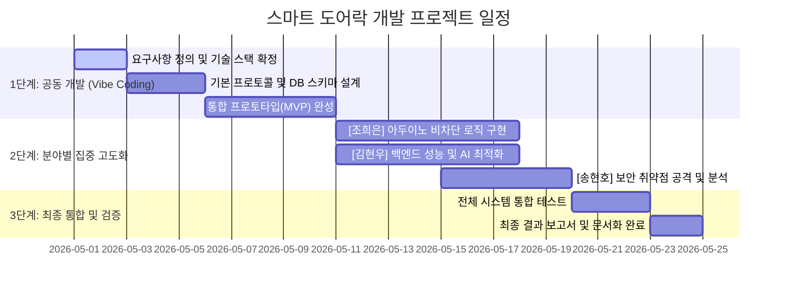

# 프로젝트 개발 일정 및 역할 분담 상세안

## 1. 팀 구성 및 역할 (R&R)

본 프로젝트는 1차 공동 개발 후, 각 분야의 전문성을 높이기 위해 다음과 같이 역할을 나누어 진행합니다.

| 이름 | 역할 | 핵심 책임 (Responsibility) |
| --- | --- | --- |
| **공동 (ALL)** | **Vibe Coding 통합 개발** | 시스템 기본 설계, 아키텍처 확립, 통합 테스트 |
| **조희은** | **Hardware / Arduino Specialist** | 펌웨어 최적화, 비차단 제어 로직, 센서 정확도 개선 |
| **김현우** | **Backend / Vision AI Architect** | Python 서버 성능 최적화, DB 구조 고도화, AI 인식 속도 개선 |
| **송현호** | **Beta Tester / QA & Security** | 취약점 분석, 사용자 경험(UX) 피드백, 엣지 케이스 도출 |

---

## 2. 세부 개발 일정 (Gantt Chart)

---

## 3. 역할별 세부 업무 리스트 (To-Do List)

### [공동] 1차 Vibe Coding 단계
- [ ] 시리얼 통신 규격(JSON 또는 String 포맷) 확정
- [ ] SQLite 기본 테이블(users, access_logs) 생성
- [ ] YOLOv8 + face_recognition 연동 기초 코드 작성
- [ ] FastAPI 기반 실시간 모니터링 대시보드 초안 완성

### [조희은] 아두이노 개발 고도화
- [ ] `delay()`를 제거한 `millis()` 기반 비차단 루프 구현
- [ ] 키패드 입력 버퍼 관리 및 예외 처리 강화
- [ ] 릴레이 작동 상태(OPEN/CLOSED) 실시간 피드백 로직
- [ ] 하드웨어 핀 맵 최적화 및 간섭 제거

### [김현우] Python 및 AI 성능 최적화
- [ ] SQLite WAL 모드 적용 및 DB 커넥션 풀링 최적화
- [ ] 비전 AI 분석 프레임워크 성능 프로파일링 및 FPS 개선
- [ ] 얼굴 인코딩 데이터의 보안 저장(해싱/암호화) 및 로드 속도 향상
- [ ] 비동기(Asyncio) 처리를 통한 웹 서버 응답성 강화

### [송현호] 베타 테스트 및 보안 강화
- [ ] 사진/영상을 이용한 얼굴 인식 우회 시나리오 테스트
- [ ] 키패드 무차별 대입 공격에 대한 락다운 로직 검증
- [ ] 시스템 부하 테스트 및 비정상 종료 시 복구 프로세스 점검
- [ ] 비전문가 관점의 설치 및 설정 가이드 가독성 피드백

---

## 4. 진행 현황 관리 (Weekly Check-in)

- **월요일:** 주간 목표 설정 및 역할별 이슈 공유
- **수요일:** 기술적 병목 구간(Blocking Point) 해결을 위한 공동 코딩
- **금요일:** 주간 결과물 통합 및 상호 코드 리뷰
