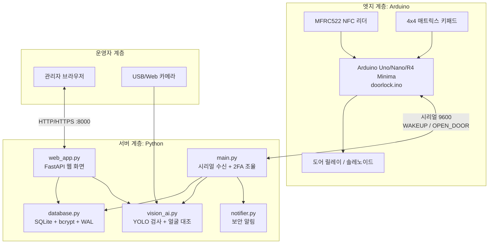
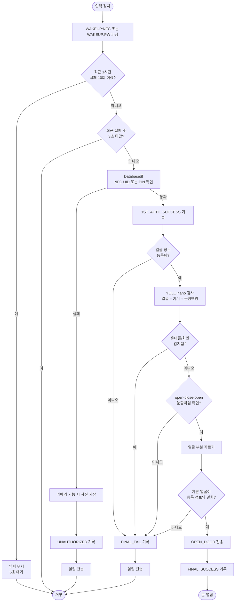
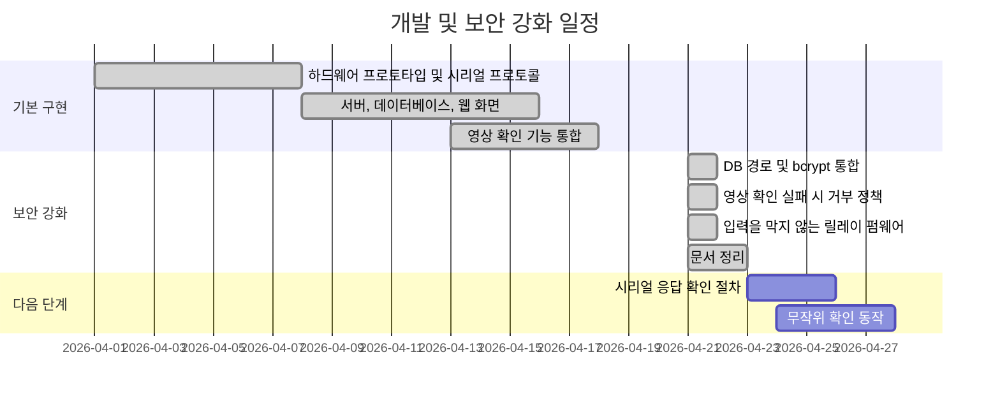
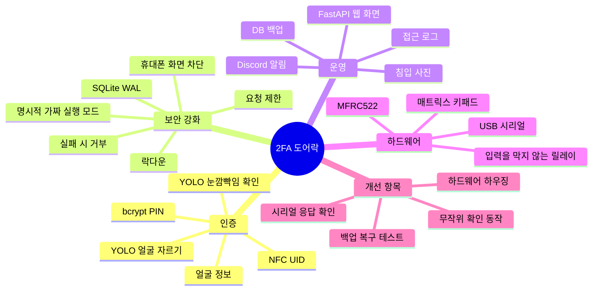

# 2FA 스마트 도어락 설계

## 1. 개요
NFC 또는 PIN을 1차 확인으로 사용하고, YOLO nano와 등록 얼굴 대조를 2차 확인으로 사용하는 출입 제어 시스템이다. Arduino는 입력 장치와 릴레이를 제어한다. Python 서버는 인증 판단, 로그, 알림, 웹 화면을 담당한다.

기본 정책은 실패 시 거부다. YOLO 모델, 카메라, 등록된 얼굴 정보, 영상 처리 라이브러리가 준비되지 않으면 실제 사용 모드에서 문을 열지 않는다.

## 2. 블록 다이어그램

## 3. 처리 흐름

## 4. 개발 일정

## 5. 마인드맵

## 6. 실행 설정
| 변수 | 기본값 | 목적 |
| --- | --- | --- |
| `DOORLOCK_DB_PATH` | `server/doorlock.db` | 서버와 웹 화면이 공유하는 SQLite 경로 |
| `DOORLOCK_WEB_HOST` | `0.0.0.0` | 대시보드 bind host. 로컬 전용은 `127.0.0.1` 사용 |
| `DOORLOCK_WEB_PORT` | `8000` | 대시보드 HTTP/HTTPS 포트 |
| `DOORLOCK_LEGACY_FLASK_PORT` | `5000` | 이전 Flask 화면을 직접 실행할 때만 쓰는 포트 |
| `DOORLOCK_FLASK_DEBUG` | `0` | 이전 Flask 화면 debug 모드. 운영에서는 `0` 유지 |
| `DOORLOCK_SERIAL_PORT` | `/dev/ttyACM0` | Arduino 시리얼 장치. Windows는 `COM3` 형식 사용 |
| `DOORLOCK_BAUD_RATE` | `9600` | 펌웨어와 맞춰야 하는 시리얼 baud rate |
| `DOORLOCK_SERIAL_RECONNECT_INTERVAL_SECONDS` | `5.0` | 시리얼 연결 실패 후 재연결 시도 간격 |
| `DOORLOCK_DB_BACKUP_INTERVAL_SECONDS` | `3600.0` | SQLite 자동 백업 주기 |
| `DOORLOCK_DISCORD_WEBHOOK_URL` | 비어 있음 | 선택 보안 알림 webhook. 비어 있으면 로컬 로그만 남김 |
| `DOORLOCK_NOTIFIER_TIMEOUT_SECONDS` | `5.0` | webhook 전송이 인증 흐름을 붙잡는 최대 시간 |
| `DOORLOCK_RATE_LIMIT_SECONDS` | `3.0` | 실패 후 다음 입력을 무시하는 최소 대기 시간 |
| `DOORLOCK_LOCKDOWN_FAILURE_LIMIT` | `10` | 최근 1시간 실패가 이 값 이상이면 입력 무시 |
| `DOORLOCK_LOCKDOWN_DELAY_SECONDS` | `5.0` | 잠금 상태에서 입력을 받은 뒤 적용하는 지연 |
| `DOORLOCK_LOCKDOWN_ALERT_COOLDOWN_SECONDS` | `60.0` | 잠금 알림 반복 발송을 제한하는 시간 |
| `DOORLOCK_VISION_MOCK` | `0` | 데모 전용 얼굴 확인 우회. 실제 사용 시 `0` 유지 |
| `DOORLOCK_ALLOW_UNENROLLED_FACE` | `0` | 얼굴 미등록 사용자를 위한 데모 전용 예외. 운영에서는 `0` 유지 |
| `DOORLOCK_ALLOW_LEGACY_FACE_PICKLE` | `0` | 이전 pickle 얼굴 템플릿 읽기 허용. 마이그레이션 때만 임시 사용 |
| `DOORLOCK_FACE_TOLERANCE` | `0.6` | `face_recognition.compare_faces` 허용 오차. 낮을수록 엄격함 |
| `DOORLOCK_YOLO_ENABLED` | `1` | 얼굴 대조 전 YOLO nano 검사 활성화 |
| `DOORLOCK_YOLO_MODEL_PATH` | `models/doorlock_yolov8n.pt` | 얼굴, 화면류 객체, 눈 상태를 찾는 로컬 YOLO nano 모델 파일 |
| `DOORLOCK_YOLO_CONFIDENCE` | `0.35` | YOLO 감지 최소 신뢰도 |
| `DOORLOCK_YOLO_OBSERVATION_SECONDS` | `4.5` | 눈깜빡임 확인 관찰 시간 |
| `DOORLOCK_YOLO_FRAME_INTERVAL_SECONDS` | `0.15` | YOLO 검사 프레임 간격 |
| `DOORLOCK_YOLO_CROP_MARGIN` | `0.2` | 얼굴 부분을 자르기 전에 더하는 여백 |
| `DOORLOCK_YOLO_REQUIRE_BLINK` | `1` | 인증 시 open-close-open 눈깜빡임 요구 |
| `DOORLOCK_YOLO_FACE_CLASSES` | `face` | 얼굴로 인정할 YOLO 분류 이름 |
| `DOORLOCK_YOLO_PHONE_CLASSES` | `cell phone,...` | 휴대폰, 화면, 태블릿, 노트북, 모니터 분류 이름 |
| `DOORLOCK_YOLO_OPEN_EYE_CLASSES` | `open_eye,...` | 열린 눈 분류 이름 |
| `DOORLOCK_YOLO_CLOSED_EYE_CLASSES` | `closed_eye,...` | 감긴 눈 분류 이름 |

## 7. 모듈 계약
| 파일 | 책임 | 비고 |
| --- | --- | --- |
| `server/main.py` | 시리얼 수신, 2FA 조율, 실패 제한, 락다운, 릴레이 명령 | 최종 성공 후에만 `OPEN_DOOR` 전송 |
| `server/database.py` | SQLite 구조, bcrypt 해싱, 로그 조회, DB 대기 설정 | 기존 평문 PIN은 성공 매칭 후 bcrypt로 승격 |
| `server/vision_ai.py` | 카메라, YOLO 검사, 눈깜빡임 확인, 자른 얼굴 대조 | `DOORLOCK_VISION_MOCK=1`이 아니면 실패 시 거부 |
| `server/web_app.py` | FastAPI 웹 화면, 등록, 사진, 영상 feed | `Database`를 사용하고 로그 직접 SQL을 피함 |
| `server/app.py` | 이전 Flask 웹 화면 | `Database`를 사용하고 평문 등록을 피함 |
| `arduino/doorlock.ino` | 기준 Arduino 펌웨어 | 입력을 막지 않는 릴레이 타이머, `OPEN_DOOR`와 호환 |

## 8. 데이터와 상태 모델
| 테이블 | 주요 필드 | 목적 |
| --- | --- | --- |
| `users` | `username`, `nfc_uid`, `password`, `face_encoding` | 사용자 식별, 1차 인증 정보, 얼굴 템플릿 |
| `access_logs` | `timestamp`, `method`, `status`, `snapshot` | 감사 로그와 웹 화면 경고 근거 |

| 상태 | 의미 |
| --- | --- |
| `1ST_AUTH_SUCCESS` | NFC 또는 PIN이 등록 사용자와 일치 |
| `FINAL_SUCCESS` | 얼굴 확인 통과 후 릴레이 명령 전송 |
| `FINAL_FAIL` | 1차 확인은 통과했지만 얼굴 확인 실패 |
| `UNAUTHORIZED` | 얼굴 확인 전에 NFC 또는 PIN 실패 |

## 9. 시리얼 프로토콜
| 방향 | 메시지 | 의미 |
| --- | --- | --- |
| Arduino -> 서버 | `WAKEUP:NFC:<UID>` | NFC 카드 감지. UID는 대문자 hexadecimal 사용 |
| Arduino -> 서버 | `WAKEUP:PW:<PIN>` | 키패드 PIN 전송 |
| 서버 -> Arduino | `OPEN_DOOR` | `DOOR_OPEN_MS` 동안 릴레이 열림 |
| Arduino -> 서버 | `DOOR_OPENED`, `DOOR_CLOSED` | 릴레이 상태 알림 |

현재 시리얼 통신은 평문이다. USB와 배선은 잠금형 하우징 안에 두고, 다음 보안 단계에서 응답 확인 절차를 추가한다.
