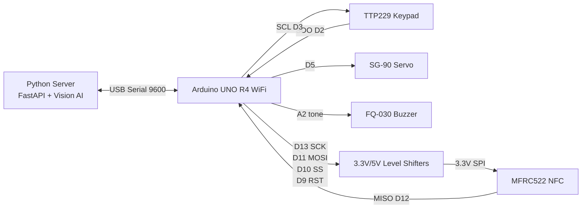

# 최종 배선 가이드

이 문서는 Arduino UNO R4 WiFi 기준 2FA 스마트 도어락 프로토타입을 실제로 꽂을 때 사용하는 배선 순서이다. 기준 펌웨어는 `arduino/doorlock_firmware/doorlock_firmware.ino`이다.

## 0. 먼저 확인할 것

| 항목 | 기준 |
|---|---|
| Arduino 보드 | UNO R4 WiFi |
| 펌웨어 | `arduino/doorlock_firmware/doorlock_firmware.ino` |
| Serial | USB-C, 9600 baud |
| 키패드 | TTP229 8키 모드 |
| NFC | MFRC522, SPI, 3.3V |
| 액추에이터 | SG-90 서보모터 |
| 부저 | FQ-030 수동 부저 |

중요한 전원 규칙은 세 가지다.

1. MFRC522에는 3.3V만 공급한다.
2. 서보와 부저 전원은 GPIO 핀에서 공급하지 않는다.
3. 외부 5V 전원을 쓰더라도 Arduino와 모든 모듈의 GND는 공통으로 묶는다.
4. Arduino USB 5V와 외부 5V 어댑터를 같은 5V 레일에 병렬로 묶지 않는다. 외부 전원을 쓸 때는 서보/부저 전원 레일만 별도 공급하고 GND만 공통으로 묶는 구성을 우선한다.

## 1. 준비물

- Arduino UNO R4 WiFi
- 브레드보드
- 점퍼선 M-M, M-F
- TTP229 터치 키패드 모듈
- MFRC522 NFC 모듈
- 2채널 TTL 3.3V/5V 레벨 시프터 2개
- SG-90 서보모터
- FQ-030 수동 부저
- USB-C 케이블
- 5V 외부 전원 어댑터 또는 충분한 전류를 공급하는 USB 전원

## 2. 최종 핀 맵

| Arduino 핀 | 연결 대상 | 전압/경유 | 코드 상수 또는 역할 |
|---|---|---|---|
| `D2` | TTP229 `SDO` | 직접 연결 | `KP_SDO_PIN` |
| `D3` | TTP229 `SCL` | 직접 연결 | `KP_SCL_PIN` |
| `D5` | SG-90 신호선 | 직접 연결 | `SERVO_PIN` |
| `A2` | FQ-030 `I/O` | 직접 연결 | `BUZZER_IO_PIN` |
| `D9` | MFRC522 `RST` | 레벨 시프터 경유 | `NFC_RST_PIN` |
| `D10` | MFRC522 `SDA/SS` | 레벨 시프터 경유 | `NFC_SS_PIN` |
| `D11` | MFRC522 `MOSI` | 레벨 시프터 경유 | SPI MOSI |
| `D12` | MFRC522 `MISO` | 직접 연결 | SPI MISO |
| `D13` | MFRC522 `SCK` | 레벨 시프터 경유 | SPI SCK |
| `5V` | 5V 레일 | 전원 | TTP229, 서보, 부저, 시프터 HV |
| `3.3V` | 3.3V 레일 | 전원 | MFRC522, 시프터 LV |
| `GND` | GND 레일 | 전원 기준 | 모든 모듈 공통 |

## 3. 전체 연결도



## 4. 배선 순서

### Step 1. 전원 레일 만들기

1. Arduino `GND`를 브레드보드 `-` 레일에 연결한다.
2. Arduino `5V`를 브레드보드 5V `+` 레일에 연결한다.
3. Arduino `3.3V`를 브레드보드 3.3V 전용 레일에 연결한다.
4. 브레드보드 양쪽 전원 레일을 모두 쓸 경우, 같은 전압끼리 점퍼선으로 이어준다.

브레드보드 제품에 따라 긴 전원 레일이 중간에서 끊겨 있을 수 있다. 멀티미터가 있으면 5V 레일, 3.3V 레일, GND 레일의 연속성을 먼저 확인한다.

### Step 2. TTP229 터치 키패드 연결

| TTP229 핀 | 연결 |
|---|---|
| `VCC` | 5V 레일 |
| `GND` | GND 레일 |
| `SDO` | Arduino `D2` |
| `SCL` | Arduino `D3` |

현재 펌웨어는 8키 모드 기준이다. TP2를 GND에 쇼트해서 16키 모드를 쓰려면 키패드 매핑 코드를 같이 수정해야 한다.

### Step 3. FQ-030 수동 부저 연결

| 부저 핀 | 연결 |
|---|---|
| `VCC` | 5V 레일 |
| `GND` | GND 레일 |
| `I/O` 또는 신호 | Arduino `A2` |

수동 부저는 `tone(A2, 주파수, 시간)` 방식으로 동작한다. 부저 보드가 아닌 2핀 피에조 부저만 사용하는 경우에는 한쪽을 `A2`, 다른 한쪽을 GND에 연결해서 테스트한 뒤 음량이 부족하면 부저 모듈 또는 드라이버 회로를 사용한다.

### Step 4. SG-90 서보모터 연결

| 서보 선 색상 | 연결 |
|---|---|
| 빨강 | 5V 레일 |
| 갈색 또는 검정 | GND 레일 |
| 주황 또는 노랑 | Arduino `D5` |

서보가 움직일 때 Arduino가 재부팅되거나 서보가 떨리면 5V 전원 전류가 부족한 상태일 가능성이 높다. 외부 5V 전원을 사용할 때도 GND는 Arduino GND와 공통으로 연결한다.

### Step 5. 레벨 시프터 전원 연결

레벨 시프터 2개를 사용해 총 4채널을 확보한다.

| 레벨 시프터 핀 | 연결 |
|---|---|
| `HV` 또는 `+5V` | 5V 레일 |
| `LV` 또는 `+3.3V` | 3.3V 레일 |
| `GND` | GND 레일 |

두 레벨 시프터 모두 `HV`, `LV`, `GND`가 연결되어야 한다.

### Step 6. MFRC522 NFC 신호 연결

Arduino에서 MFRC522로 나가는 5V 신호 4개는 레벨 시프터를 거친다.

| Arduino | 레벨 시프터 HV | 레벨 시프터 LV | MFRC522 | 비고 |
|---|---|---|---|---|
| `D13` | `HV1` | `LV1` | `SCK` | SPI clock |
| `D11` | `HV2` | `LV2` | `MOSI` | Arduino -> NFC |
| `D10` | `HV3` | `LV3` | `SDA/SS` | Slave Select |
| `D9` | `HV4` | `LV4` | `RST` | Reset |

MFRC522에서 Arduino로 들어오는 `MISO`는 현재 기준에서 직결한다.

| MFRC522 | Arduino | 비고 |
|---|---|---|
| `MISO` | `D12` | 3.3V 출력, 현재 직결 기준 |
| `3.3V` | 3.3V 레일 | 5V 금지 |
| `GND` | GND 레일 | 공통 접지 |
| `IRQ` | 연결 안 함 | 현재 코드에서 미사용 |

## 5. ESP32-CAM 사용 여부

현재 기준 펌웨어는 ESP32-CAM을 Arduino에 직접 연결하지 않는다. Arduino는 도어락 입출력 전용이고, ESP32-CAM은 노트북에 별도 USB-C로 연결한다.

중요: ESP32-CAM + CH340 USB-C 보드는 일반 USB 웹캠이 아니다. USB-C는 전원/업로드/Serial 통신용이고, OpenCV의 `DOORLOCK_CAMERA_URL=0`으로 바로 잡히지 않는다. USB-C 직접 연결 방식으로 쓰려면 `esp32cam/serial_camera/serial_camera.ino`를 ESP32-CAM에 업로드하고 Python 서버에서 Serial JPEG 소스로 읽는다.

| 사용 방식 | 연결 |
|---|---|
| USB 웹캠 | 서버 PC/Raspberry Pi에 직접 연결, `DOORLOCK_CAMERA_URL=0` |
| ESP32-CAM USB-C Serial | ESP32-CAM에 `esp32cam/serial_camera/serial_camera.ino` 업로드, `DOORLOCK_CAMERA_URL=serial:auto` 또는 `serial:/dev/ttyUSB0` |
| ESP32-CAM IP 스트림 | 별도 Wi-Fi 스트림 펌웨어 사용 시 `DOORLOCK_CAMERA_URL`에 스트림 URL 지정 |

ESP32-CAM은 Arduino 5V 레일에서 같이 먹이지 않는다. 노트북 USB-C에 직접 연결하거나 별도 5V 전원을 사용한다.

## 6. 업로드 및 첫 부팅

1. Arduino IDE 또는 `arduino-cli`에서 `arduino/doorlock_firmware/doorlock_firmware.ino`를 연다.
2. 보드는 Arduino UNO R4 WiFi로 선택한다.
3. 필요한 라이브러리를 설치한다.
   - `MFRC522`
   - `Servo`
4. 업로드한다.
5. Serial Monitor를 `9600` baud로 열고 `SYSTEM_READY`가 출력되는지 확인한다.

펌웨어는 USB Serial 안정화를 위해 `SYSTEM_READY`를 두 번 보낸다. 같은 메시지가 두 번 보이는 것은 정상이다.

주의: `arduino/doorlock.ino`와 루트의 `arduino/doorlock_firmware.ino`는 레거시 스케치다. 내일 배선은 현재 문서와 맞는 `arduino/doorlock_firmware/doorlock_firmware.ino`만 업로드한다.

## 7. 서버 실행

실제 하드웨어 모드:

```bash
source .venv/bin/activate
ls /dev/ttyACM* /dev/ttyUSB* 2>/dev/null
DOORLOCK_SERIAL_PORT=auto \
DOORLOCK_VISION_MOCK=false \
DOORLOCK_YOLO_ENABLED=false \
python3 server/main.py
```

서버는 `/dev/ttyACM*`, `/dev/ttyUSB*` 후보를 순서대로 열고 `PING` 응답으로 Arduino를 식별한다. Arduino 펌웨어가 최신이면 `PONG:DOORLOCK_ARDUINO`를 반환하므로 ESP32-CAM이나 Xilinx USB 장치와 구분된다.

카메라/얼굴 인증 준비가 불안정한 상태에서 문 열림과 Serial/서보 동작을 먼저 확인할 때:

```bash
source .venv/bin/activate
DOORLOCK_SERIAL_PORT=auto \
DOORLOCK_VISION_MOCK=true \
DOORLOCK_YOLO_ENABLED=false \
python3 server/main.py
```

Arduino 자동 감지가 실패할 때만 직접 지정한다.

```bash
DOORLOCK_SERIAL_PORT=/dev/ttyACM0 python3 server/main.py
```

## 8. 부품별 단독 점검

### TTP229

`arduino/ttp229_test/ttp229_test.ino` 업로드 후 Serial Monitor에서 눌린 키 번호가 출력되는지 확인한다.

### NFC

Serial Monitor에서 태그를 가까이 댔을 때 아래 형식이 출력되어야 한다.

```text
WAKEUP:NFC:A1B2C3D4
```

태그를 대도 비프음이 전혀 없고 `WAKEUP:NFC:<UID>`도 나오지 않으면 사용자 등록 문제가 아니라 MFRC522 리더 통신 문제로 본다. `NFC_VERSION:0x00` 또는 `0xFF`가 반복되면 Arduino가 MFRC522 칩 자체를 SPI로 읽지 못하는 상태다. 이 경우 카드 종류나 등록 여부를 바꿔도 해결되지 않는다.

출력이 없으면 다음 순서로 확인한다.

1. MFRC522 전원이 3.3V인지 확인
2. 레벨 시프터 `HV=5V`, `LV=3.3V`, `GND=공통` 확인
3. `D10`, `D11`, `D13`, `D9`가 HV 쪽으로 들어가는지 확인
4. MFRC522 `SDA/SS`, `MOSI`, `SCK`, `RST`가 LV 쪽에서 나오는지 확인
5. `MISO -> D12` 직결 확인
6. MFRC522의 `SDA`는 I2C SDA가 아니라 SPI `SS/CS`이므로 Arduino `D10`에 연결했는지 확인
7. 레벨 시프터 채널 방향과 접촉이 의심되면 `SCK`, `MOSI`, `SDA/SS`, `RST`를 한 채널씩 다시 꽂아 확인

### 서보

서버 또는 Serial에서 `OPEN_DOOR` 명령을 받으면 서보가 90도로 이동하고 약 3초 뒤 0도로 돌아와야 한다.

```text
OPEN_DOOR
DOOR_OPENED
DOOR_CLOSED
```

### 부저

키 입력 시 짧은 소리가 나고, 서버가 `AUTH_FAIL` 또는 `LOCKDOWN`을 보내면 다른 패턴의 소리가 나야 한다.

## 9. 최종 체크리스트

- [ ] Arduino GND와 모든 모듈 GND가 공통이다.
- [ ] 5V 레일과 3.3V 레일이 서로 쇼트되어 있지 않다.
- [ ] MFRC522 `3.3V` 핀에 5V가 들어가지 않는다.
- [ ] 레벨 시프터 2개 모두 `HV`, `LV`, `GND`가 연결되어 있다.
- [ ] TTP229 `SDO -> D2`, `SCL -> D3`가 맞다.
- [ ] 서보 신호선은 `D5`에 연결되어 있다.
- [ ] 부저 신호선은 `A2`에 연결되어 있다.
- [ ] Serial Monitor에서 `SYSTEM_READY`가 보인다.
- [ ] Serial Monitor에서 `PING` 입력 시 `PONG:DOORLOCK_ARDUINO`가 보인다.
- [ ] 키 입력 시 `WAKEUP:PW:<PIN>`이 보인다.
- [ ] NFC 태그 접촉 시 `WAKEUP:NFC:<UID>`가 보인다.
- [ ] 서버에서 인증 성공 시 `OPEN_DOOR`, 실패 시 `AUTH_FAIL`, 잠금 시 `LOCKDOWN`을 보낸다.
- [ ] 웹 GUI의 Hardware Link Status에서 Arduino와 ESP32-CAM 상태가 보이고, Retry 버튼이 동작한다.

## 10. 문제 해결표

| 증상 | 우선 확인할 것 |
|---|---|
| 서버가 Arduino를 못 찾음 | GUI Hardware Link Status의 후보 포트, `/dev/ttyACM*`, USB-C 케이블, 최신 펌웨어의 `PING` 응답 |
| `SYSTEM_READY`가 안 보임 | 보드/포트 선택, 업로드 성공 여부, Serial Monitor baud 9600 |
| 키패드가 안 먹음 | `D2/D3` 반대 연결 여부, TTP229 전원, `ttp229_test` 결과 |
| NFC가 안 읽힘 | 카드 등록 문제가 아니라 리더 통신부터 확인. `NFC_VERSION:0x00`/`0xFF`이면 MFRC522 3.3V, 공통 GND, 레벨 시프터 `HV/LV/GND`, `SDA/SS=D10`, `RST=D9`, `MOSI=D11`, `MISO=D12`, `SCK=D13` 순서로 재점검 |
| 서보가 떨림 | 5V 전원 전류 부족, GND 공통, 서보 신호 `D5` |
| 부저 소리가 작음 | 5V 레일 공급, 수동/능동 부저 구분, `A2` 연결 |
| 인증은 되는데 문이 안 열림 | 서버가 `OPEN_DOOR`를 보내는지, 펌웨어가 같은 포트에 연결됐는지 확인 |
| 실패가 반복되는데 Lockdown이 안 됨 | Rate limit 때문에 실패 로그가 충분히 쌓이지 않았을 수 있음. 테스트에서는 `DOORLOCK_RATE_LIMIT_SECONDS=0` 사용 |
| 등록된 사용자도 계속 실패함 | 실제 카메라/얼굴 등록이 준비되지 않았으면 `DOORLOCK_VISION_MOCK=true`, 실제 2FA 시연이면 `DOORLOCK_VISION_MOCK=false`, `DOORLOCK_YOLO_ENABLED=false`, USB 웹캠은 `DOORLOCK_CAMERA_URL=0`, ESP32-CAM USB-C Serial은 `DOORLOCK_CAMERA_URL=serial:auto` 확인 |
