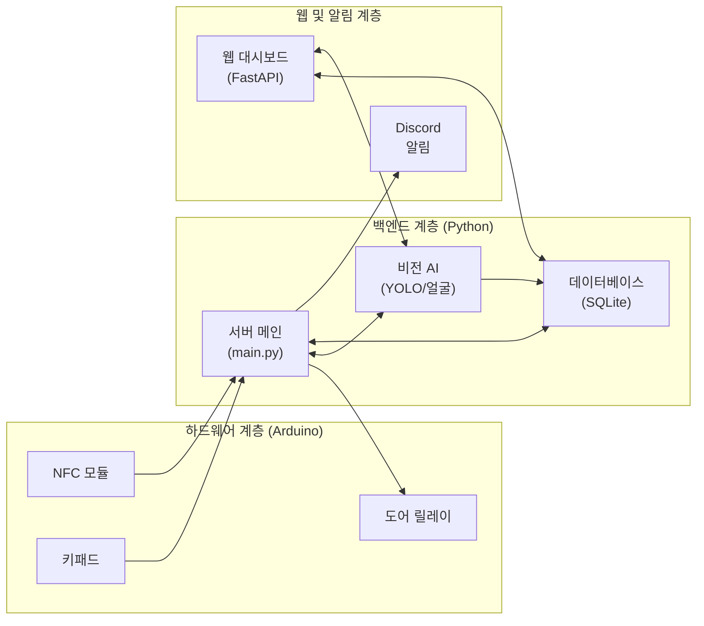

# 2FA 스마트 도어락: 지능형 이중 인증 시스템

SYU - Sahmyook University 디지털 논리 회로 실습 캡스톤디자인


NFC/PIN 1차 인증과 YOLOv8 기반 얼굴 인식 2차 인증을 결합한 고성능 스마트 도어락 시스템입니다. 본 프로젝트는 보안의 세 가지 요소 중 '소유(NFC)', '지식(PIN)', '존재(얼굴)'를 결합하여 빈틈없는 보안 환경을 구축하는 것을 목표로 합니다.

```text
최종 승인 = (인증 수단 일치) + (생체 감지 통과) + (등록 얼굴 일치)
```

> **보안 철학:** 모든 인증 단계는 'Fail-Safe' 원칙을 따릅니다. 인공지능 모델 미로드, 카메라 연결 오류 등 시스템의 불완전한 상태가 감지되면 출입을 즉시 차단하여 잠금 상태를 유지합니다.

## Features (주요 기능)
- **이중 인증 (2FA):** 1차 인증(NFC/PIN) + 2차 인증(얼굴 및 눈 깜빡임 인식)
- **스푸핑 방지:** YOLO를 이용한 모바일 기기/화면 사진 인식 및 차단
- **Web GUI (FastAPI):** 실시간 비디오 피드, 사용자 관리 및 시각화된 대시보드
- **보안 알림:** 비정상적 접근 시도 시 Discord 웹훅을 통한 스냅샷 알림
- **시스템 보호:** 반복된 실패 시 일정 시간 입력을 무시하는 Lockdown 모드

## 시스템 아키텍처 한눈에 보기


## 시스템 구성

| 영역 | 파일 | 역할 |
| --- | --- | --- |
| 펌웨어 | `arduino/doorlock.ino` | NFC, 키패드, 릴레이 제어 |
| 서버 | `server/main.py` | 시리얼 수신, 2FA 흐름 제어, 실패 제한 |
| 데이터베이스 | `server/database.py` | SQLite, bcrypt PIN 해싱, 접근 로그 |
| 영상 확인 | `server/vision_ai.py` | YOLO 검사, 얼굴 자르기, 얼굴 대조 |
| 웹 화면 | `server/web_app.py` | 사용자 등록, 실시간 영상, 로그, 사진 |

얼굴 확인 흐름:

```text
카메라 화면 -> YOLO nano -> 얼굴 자르기 + 휴대폰/화면 차단 + 눈깜빡임 확인 -> face_recognition
```

YOLO는 원본 화면에서 얼굴, 휴대폰이나 화면, 눈 상태를 먼저 찾는다. 인증할 때는 눈을 뜬 상태에서 감았다가 다시 뜨는 동작이 필요하다. 그 다음 얼굴 부분만 잘라 등록된 얼굴 정보와 비교한다.

## Getting Started (실행 방법)

```bash
python3 -m venv .venv
source .venv/bin/activate
pip install -r requirements.txt
python3 server/main.py
```

### GUI Access (웹 기반 사용자 화면)
서버(`main.py`)가 실행되면 내부적으로 FastAPI 기반의 웹 GUI 서비스가 함께 백그라운드에서 구동됩니다.
- **기본 접속:** `http://localhost:8000`
- **보안(HTTPS) 접속:** `server/cert.pem`, `server/key.pem` 파일이 존재할 경우 `https://localhost:8000`

웹 GUI에서는 다음과 같은 기능을 직관적으로 관리할 수 있습니다:
- 실시간 접근 기록(로그) 확인
- 침입 시도 스냅샷 열람
- 시스템 알림 상태 확인
- 새로운 사용자 얼굴 캡처 및 등록
- 기존 등록된 사용자 관리

대시보드 bind 주소와 포트는 필요하면 아래처럼 조정한다.

```bash
export DOORLOCK_WEB_HOST=127.0.0.1
export DOORLOCK_WEB_PORT=8000
```

## 하드웨어

1. Arduino IDE에서 `MFRC522`, `Keypad` 라이브러리를 설치한다.
2. [하드웨어 사양](system_docs/hardware_spec.md)의 핀맵대로 배선한다.
3. `arduino/doorlock.ino`를 업로드한다.
4. 서버의 `DOORLOCK_SERIAL_PORT`를 실제 포트로 설정한다.

```bash
export DOORLOCK_SERIAL_PORT=/dev/ttyACM0
export DOORLOCK_BAUD_RATE=9600
python3 server/main.py
```

Arduino R4 Minima는 UNO 계열 핀 배치에 맞춰 사용할 수 있다. 업로드 전 Arduino IDE에서 보드와 포트를 R4 Minima로 선택한다.

## 영상 모델

기본 모델 경로:

```bash
export DOORLOCK_YOLO_MODEL_PATH=models/doorlock_yolov8n.pt
```

모델의 분류 이름이 다른 경우 아래 값을 쉼표로 구분해 지정한다.

```bash
export DOORLOCK_YOLO_FACE_CLASSES=face
export DOORLOCK_YOLO_PHONE_CLASSES="cell phone,phone,screen,tablet,laptop,monitor"
export DOORLOCK_YOLO_OPEN_EYE_CLASSES="open_eye,eye_open,open"
export DOORLOCK_YOLO_CLOSED_EYE_CLASSES="closed_eye,eye_closed,closed"
```

하드웨어 없이 서버 흐름만 확인할 때만 가짜 실행 모드를 사용한다.

```bash
export DOORLOCK_VISION_MOCK=1
python3 server/main.py
```

## 검증

```bash
python3 -B -m unittest discover -s server -p 'test*.py'
```

## 보안 기준

- PIN은 bcrypt로 저장한다.
- 기존 평문 PIN은 일치 확인 후 bcrypt로 승격한다.
- 영상 단계는 YOLO 검사와 얼굴 매칭을 모두 통과해야 한다.
- 휴대폰, 태블릿, 노트북, 모니터류 객체가 감지되면 얼굴 인증을 진행하지 않는다.
- 3회 연속 실패는 대시보드 경고로 표시한다.
- 최근 1시간 실패가 `DOORLOCK_LOCKDOWN_FAILURE_LIMIT` 이상이면 입력을 일시적으로 무시한다.
- 실패 후 재시도 대기 시간은 `DOORLOCK_RATE_LIMIT_SECONDS`로 조정한다.
- 웹 등록은 NFC UID를 대문자 hex로 정규화하고 PIN은 4-8자리 숫자로 제한한다.
- 시리얼 통신은 평문이다. 실제 설치 시 USB와 릴레이 배선은 하우징 안에 둔다.

## 핵심 문서 라이브러리

- **[초보자 정복 가이드](system_docs/EASY_GUIDE.md): 입문자를 위한 용어 해설 및 작동 원리**
- **[개발 일정 및 역할](system_docs/DEVELOPMENT_PLAN.md): 팀원별 역할 분담 및 상세 To-Do 리스트**
- **[발표 자료 구성안](system_docs/PRESENTATION_GUIDE.md): PPT 제작을 위한 슬라이드별 가이드**
- **[바이브 코딩 프롬프트](vibe_prompts/main_prompt.md): 개발 가속화를 위한 AI 프롬프트 세트**
- [시스템 설계 상세](system_docs/system_design.md)
- [하드웨어 배선 및 사양](system_docs/hardware_spec.md)
- [보안 취약점 분석](SECURITY_ANALYSIS.md)
- [문제 해결 가이드](TROUBLESHOOTING.md)
