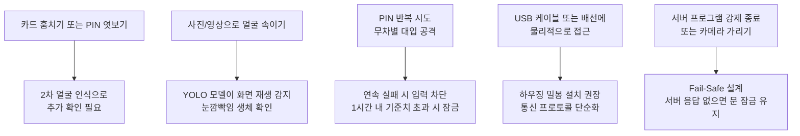

## 나쁜 사람이 도어락을 어떻게 공격할까?

이 도어락은 두 가지 인증을 모두 통과해야만 열립니다. 하나라도 실패하면 문은 잠긴 상태를 유지합니다.

```
출입 허용 = (정상 NFC 또는 정상 PIN) AND (얼굴 인식 통과)
```

카메라, 모델 파일, 등록된 얼굴 정보 중 하나라도 없으면 문은 열리지 않습니다.

---

## 위협 모델: 공격 방법과 방어 수단



---

## 위협별 쉬운 설명

| 위협 | 어떤 공격인가? | 현재 방어 수단 |
|---|---|---|
| 인증 수단 탈취 | NFC 카드를 훔치거나 PIN 번호를 몰래 보는 공격입니다. | 카드와 PIN만으로는 열 수 없습니다. 반드시 얼굴 인식을 통과해야 합니다. |
| 화면 재생 공격 | 등록된 사람의 사진이나 동영상을 카메라에 보여주는 공격입니다. | YOLO 모델이 화면과 실제 얼굴을 구분하고, 눈깜빡임(생체 확인)을 요구합니다. |
| 무차별 대입 | PIN 번호를 계속 눌러 맞추려는 시도입니다. | 연속 실패 시 입력을 차단하고, 1시간 내 기준 횟수 이상 실패하면 입력을 무시합니다. |
| 물리적 접근 | USB 케이블이나 배선을 직접 건드려 신호를 주입하는 공격입니다. | 하우징(케이스) 밀봉 설치를 권장하며, 서버 명령을 `OPEN_DOOR` 하나로 단순화했습니다. |
| 서버 강제 종료 | 카메라를 가리거나 프로그램을 끊어 인증을 무력화하는 공격입니다. | Fail-Safe 설계로, 서버 응답이 없으면 문은 항상 잠긴 상태를 유지합니다. |

---

## 운영 시 주의 사항

- `DOORLOCK_VISION_MOCK` 환경 변수는 실제 운영 환경에서 반드시 `0`으로 설정합니다. 이 값이 `1`이면 얼굴 인식을 건너뜁니다.
- `DOORLOCK_WEB_HOST`는 외부 접속이 필요 없으면 `127.0.0.1`로 설정합니다.
- 데이터베이스 파일(`DOORLOCK_DB_PATH`)은 웹 공개 폴더 밖에 보관합니다.
