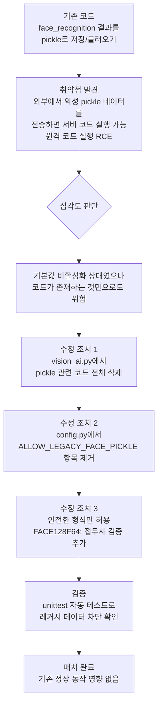

## pickle이란 무엇인가?

`pickle`은 파이썬에서 데이터를 파일로 저장하고 다시 불러올 때 사용하는 라이브러리입니다. 마치 물건을 상자에 담았다가 꺼내는 것과 같습니다. 그런데 이 상자에 악의적인 코드가 담겨 있으면, 꺼내는 순간 그 코드가 실행되는 문제가 있습니다.

---

## 취약점 발견과 수정 과정

---

## 수정 전후 비교

| 항목 | 수정 전 | 수정 후 |
|---|---|---|
| 얼굴 데이터 저장 형식 | pickle (임의 파이썬 객체) | `FACE128F64:` 접두사 형식만 허용 |
| 악성 데이터 수신 시 | 서버에서 해당 코드 실행 위험 | 형식 불일치로 즉시 거부 |
| 레거시 모드 활성화 | 환경 변수로 켤 수 있었음 | 환경 변수 자체가 삭제됨 |
| 테스트 | 별도 확인 없음 | unittest로 차단 여부 자동 검증 |

---

## 핵심 교훈

편리한 도구라도 **신뢰할 수 없는 데이터를 다룰 때는 위험**할 수 있습니다. 이번 수정은 위험한 코드를 비활성화하는 것에 그치지 않고, 코드 자체를 완전히 삭제하여 재활성화 가능성을 없앴습니다.
