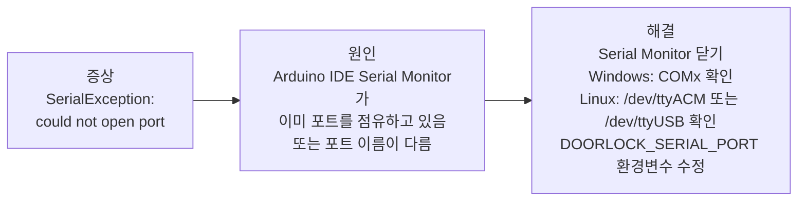
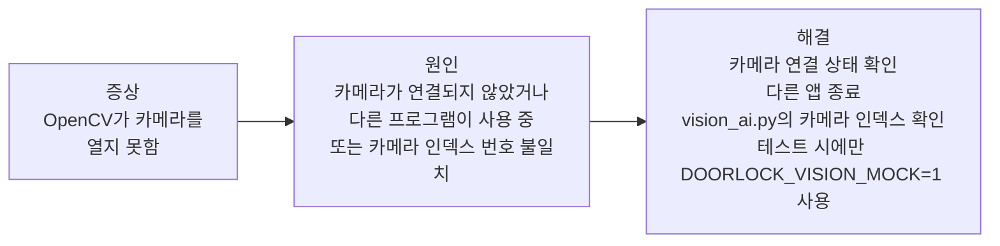
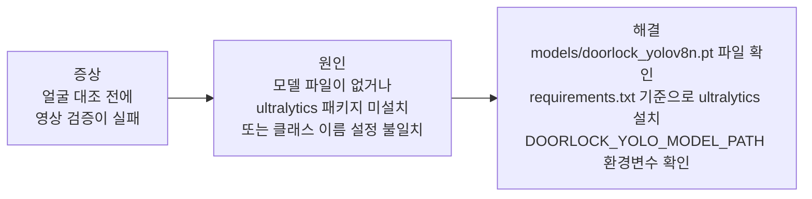
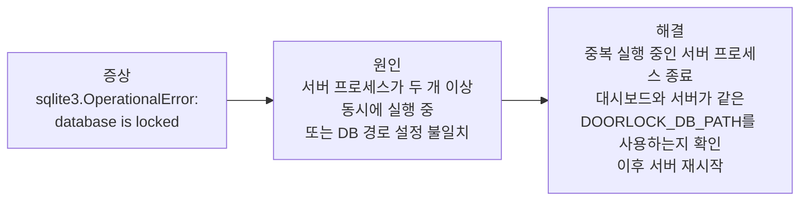
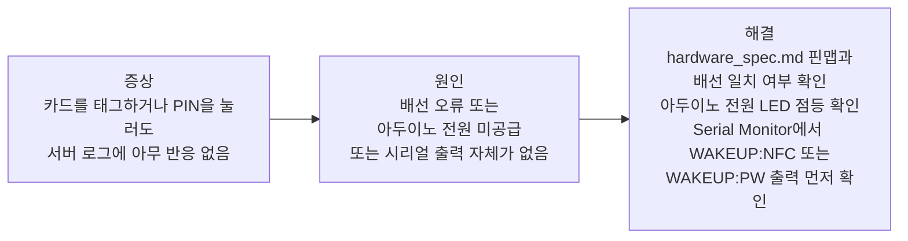

## 문제 1: 시리얼 포트를 열 수 없음

```mermaid
flowchart LR
    S1["증상\nSerialException:\ncould not open port"]
    C1["원인\nArduino IDE Serial Monitor가\n이미 포트를 점유하고 있음\n또는 포트 이름이 다름"]
    R1["해결\nSerial Monitor 닫기\nWindows: COMx 확인\nLinux: /dev/ttyACM 또는 /dev/ttyUSB 확인\nDOORLOCK_SERIAL_PORT 환경변수 수정"]
    S1 --> C1 --> R1
```

## 문제 2: 카메라를 열 수 없음

```mermaid
flowchart LR
    S2["증상\nOpenCV가 카메라를\n열지 못함"]
    C2["원인\n카메라가 연결되지 않았거나\n다른 프로그램이 사용 중\n또는 카메라 인덱스 번호 불일치"]
    R2["해결\n카메라 연결 상태 확인\n다른 앱 종료\nvision_ai.py의 카메라 인덱스 확인\n테스트 시에만 DOORLOCK_VISION_MOCK=1 사용"]
    S2 --> C2 --> R2
```

## 문제 3: YOLO 모델 로딩 실패

```mermaid
flowchart LR
    S3["증상\n얼굴 대조 전에\n영상 검증이 실패"]
    C3["원인\n모델 파일이 없거나\nultralytics 패키지 미설치\n또는 클래스 이름 설정 불일치"]
    R3["해결\nmodels/doorlock_yolov8n.pt 파일 확인\nrequirements.txt 기준으로 ultralytics 설치\nDOORLOCK_YOLO_MODEL_PATH 환경변수 확인"]
    S3 --> C3 --> R3
```

## 문제 4: 데이터베이스 잠금 오류

```mermaid
flowchart LR
    S4["증상\nsqlite3.OperationalError:\ndatabase is locked"]
    C4["원인\n서버 프로세스가 두 개 이상\n동시에 실행 중\n또는 DB 경로 설정 불일치"]
    R4["해결\n중복 실행 중인 서버 프로세스 종료\n대시보드와 서버가 같은\nDOORLOCK_DB_PATH를 사용하는지 확인\n이후 서버 재시작"]
    S4 --> C4 --> R4
```

## 문제 5: NFC 또는 키패드에 서버가 반응하지 않음

```mermaid
flowchart LR
    S5["증상\n카드를 태그하거나 PIN을 눌러도\n서버 로그에 아무 반응 없음"]
    C5["원인\n배선 오류 또는\n아두이노 전원 미공급\n또는 시리얼 출력 자체가 없음"]
    R5["해결\nhardware_spec.md 핀맵과\n배선 일치 여부 확인\n아두이노 전원 LED 점등 확인\nSerial Monitor에서 WAKEUP:NFC 또는\nWAKEUP:PW 출력 먼저 확인"]
    S5 --> C5 --> R5
```
