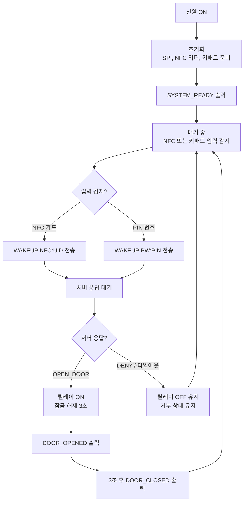
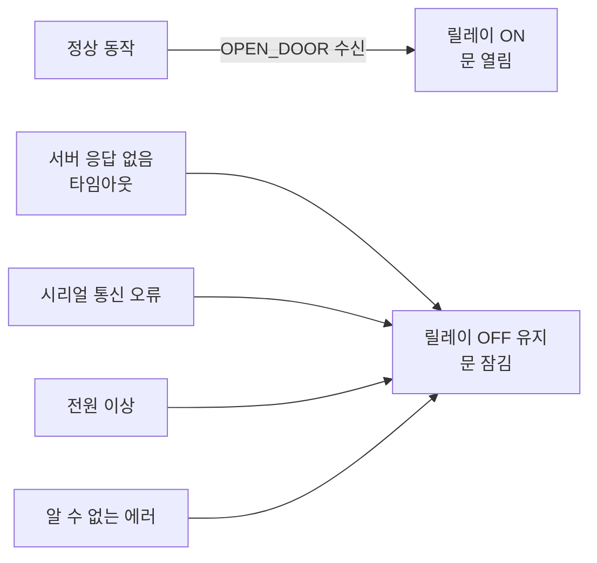

## 동작 흐름도

아두이노가 전원이 켜진 순간부터 문이 열리기까지의 전체 흐름입니다.

---

## Fail-Safe 설계

**Fail-Safe(페일 세이프)**란 시스템에 문제가 생겼을 때 자동으로 가장 안전한 상태를 유지하는 설계 방식입니다. 이 도어락은 서버와의 통신이 끊기거나 오류가 발생하더라도 문이 잠긴 상태를 유지합니다.

> 아두이노는 서버로부터 **명시적인 `OPEN_DOOR` 명령**을 받은 경우에만 릴레이를 활성화합니다. 나머지 모든 상황에서는 문이 잠긴 상태를 유지합니다.

---

## 핵심 기능 요약

| 기능 | 설명 |
|---|---|
| NFC 카드 읽기 | MFRC522 모듈이 카드의 고유 번호(UID)를 읽어 시리얼로 서버에 전달합니다. |
| PIN 번호 입력 | 4x4 키패드로 입력된 번호를 시리얼로 서버에 전달합니다. |
| 시리얼 통신 | 아두이노는 인증 판단을 직접 하지 않고 모든 판단을 서버에 위임합니다. |
| 릴레이 제어 | 서버의 허가 명령을 받은 경우에만 릴레이를 일정 시간 활성화합니다. |
| Fail-Safe | 통신 두절, 오류, 전원 이상 시 문 잠금 상태를 유지합니다. |

> 하드웨어 배선 및 핀 연결 정보는 [하드웨어 배선 및 사양](../system_docs/hardware_spec.md) 문서를 참고합니다.
