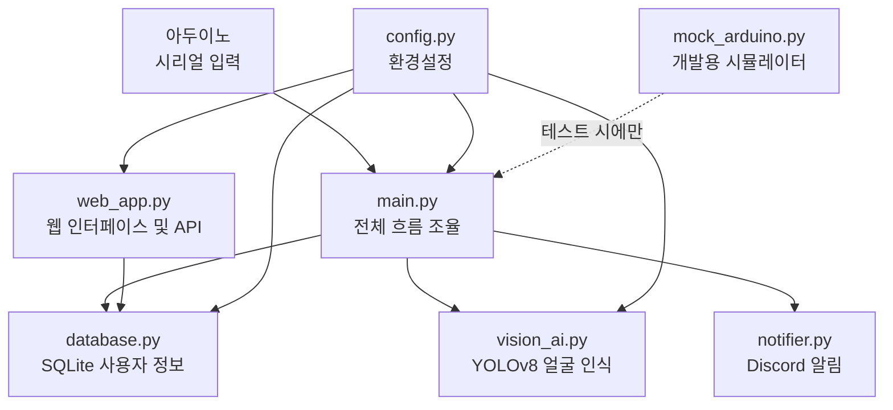
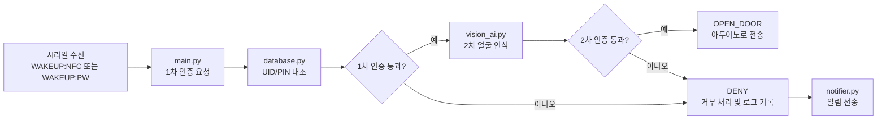

## 모듈 관계도

파이썬 서버는 `server/` 폴더 안에 여러 모듈로 나뉘어져 있습니다. `main.py`가 중심에서 나머지 모듈들을 불러 사용합니다.

---

## 데이터 흐름도

NFC 또는 PIN 입력이 들어왔을 때 서버 내부에서 데이터가 어떻게 이동하는지 나타냅니다.

---

## 모듈별 한 줄 설명

| 모듈 | 역할 |
|---|---|
| `main.py` | FastAPI 앱을 시작하고 시리얼 통신을 감시하며 인증 흐름 전체를 조율합니다. |
| `web_app.py` | 관리자 대시보드 웹 화면과 사용자 등록, 출입 기록 조회 API를 제공합니다. |
| `database.py` | SQLite로 사용자 정보와 출입 기록을 관리하고, PIN은 bcrypt로 암호화하여 저장합니다. |
| `vision_ai.py` | YOLOv8 모델로 화면 재생(사진/영상) 공격을 차단하고 등록된 얼굴을 대조합니다. |
| `notifier.py` | 인증 실패, 비정상 접근 등 보안 이벤트를 Discord 웹훅으로 관리자에게 알립니다. |
| `config.py` | 데이터베이스 경로, 시리얼 포트, Discord 웹훅 URL 등 환경 설정 값을 한곳에서 관리합니다. |
| `mock_arduino.py` | 실제 아두이노 없이 NFC 태그, PIN 입력 동작을 소프트웨어로 시뮬레이션하는 개발용 도구입니다. |

---

> **참고:** 전체 시퀀스 다이어그램과 컴포넌트 간 상세 상호작용은 [시스템 설계 상세](../system_docs/system_design.md) 문서를 참고합니다.
