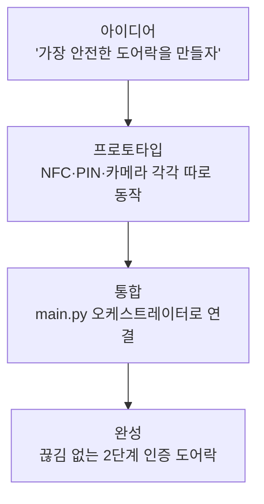

# 바이브 코딩으로 시작하기

## 바이브 코딩이란 무엇인가요?

"바이브 코딩(Vibe Coding)"이란 문법 하나하나를 외우기 전에, AI와 대화하면서 시스템의 전체 흐름(바이브)을 먼저 파악하고 빠르게 뼈대를 세우는 개발 방식입니다. 완벽한 코드보다 "일단 돌아가는 것"을 빠르게 만드는 데 집중합니다.

## 개발 흐름 한눈에 보기

## 1단계: 아이디어에서 시작

팀원 4명의 개발 경험은 제각각이었습니다. 하지만 목표는 하나였습니다. "NFC 카드나 비밀번호로 1차 인증하고, 얼굴 인식으로 2차 인증하는 스마트 도어락을 만들자." 바이브 코딩 방식 덕분에 경험 차이에 관계없이 누구나 전체 구조를 이해하며 개발에 참여할 수 있었습니다.

## 2단계: 프로토타입(MVP) 만들기

처음 3일 동안 기본 기능을 따로따로 동작시켰습니다.

- **아두이노 시리얼 전송:** NFC 카드를 대면 카드 고유 번호(UID)가 화면에 출력되었습니다.
- **파이썬 서버 기초:** 아두이노가 보낸 신호를 받아 "Hello"로 응답하는 수준에서 시작했습니다.
- **YOLOv8 첫 로드:** 카메라 영상에서 사람을 인식하는 것만으로도 팀 전체가 환호했습니다.

YOLOv8은 사람의 얼굴과 사물을 실시간으로 찾아내는 인공지능(AI) 모델입니다.

## 3단계: 통합의 어려움

각 기능은 따로따로 잘 작동했지만, 하나로 합치자 문제가 터졌습니다.

- 시리얼 포트(Serial Port, 아두이노와 컴퓨터를 연결하는 통로)를 두 프로그램이 동시에 쓰려 해서 충돌이 났습니다.
- 얼굴 인식 처리가 너무 무거워 메인 루프 전체가 멈추는 현상이 발생했습니다.

이 문제들을 해결하기 위해 `main.py`라는 오케스트레이터(지휘자 역할을 하는 파일)를 만들어 모든 신호 흐름을 한곳에서 통제하기 시작했습니다.

## 4단계: 완성

`main.py`가 자리를 잡은 뒤, 팀은 역할을 나누어 각자 맡은 부분을 깊이 파고들었습니다. 조희은은 아두이노 펌웨어(하드웨어를 제어하는 소프트웨어)를, 김현우는 파이썬 서버와 AI 성능을, 송현호는 보안 테스트를 맡아 시스템을 완성했습니다.
