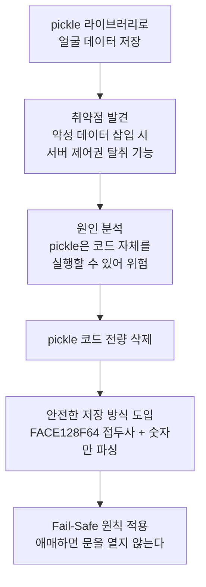

# 보안 취약점을 잡아라

## 취약점 발견부터 수정까지

## 이야기의 시작: 편리함의 함정

개발 초기, 팀은 얼굴 인식 데이터를 저장하기 위해 파이썬의 `pickle` 라이브러리를 선택했습니다. 사용법이 간단하고 빠르게 동작했기 때문입니다.

그러던 어느 날, 보안 분석을 맡은 김현우가 심각한 문제를 발견했습니다. `pickle`은 데이터를 불러올 때 파이썬 코드를 그대로 실행할 수 있는 구조였습니다. 즉, 해커가 악성 코드가 담긴 얼굴 데이터를 등록하면, 서버가 그 코드를 실행해버리는 원격 코드 실행(RCE, Remote Code Execution) 공격에 그대로 노출되어 있었던 것입니다.

쉽게 말하면, 자물쇠를 열기 위해 건네준 열쇠 안에 폭탄이 들어 있었던 셈입니다.

## 과감한 결정: 삭제와 재설계

팀은 즉시 세 가지 조치를 실행했습니다.

**첫째, pickle 코드 전량 삭제.** 편리함을 포기하고 보안을 선택했습니다. 프로젝트 안의 `pickle` 관련 모듈을 모두 제거했습니다.

**둘째, 안전한 데이터 형식 도입.** 얼굴 데이터 앞에 `FACE128F64:`라는 고유 접두사(이 데이터가 얼굴 정보임을 표시하는 표식)를 붙이고, 오직 숫자 데이터만 읽어 들이는 파싱(parsing, 데이터를 정해진 규칙에 따라 해석하는 것) 로직을 새로 만들었습니다.

**셋째, Fail-Safe 원칙 적용.** "애매하면 열지 않는다"는 규칙을 세웠습니다. AI 모델이 제대로 로드되지 않거나 카메라에 이상이 생기면 무조건 출입을 거부하도록 로직을 강화했습니다.

## 결과: 신뢰할 수 있는 시스템

이 과정을 통해 시스템은 단순히 "작동하는 소프트웨어"를 넘어 "믿을 수 있는 보안 솔루션"으로 거듭났습니다. 보안 문제를 찾고 고치는 과정에서 팀은 엔지니어가 가져야 할 책임감이 무엇인지 직접 경험했습니다.
