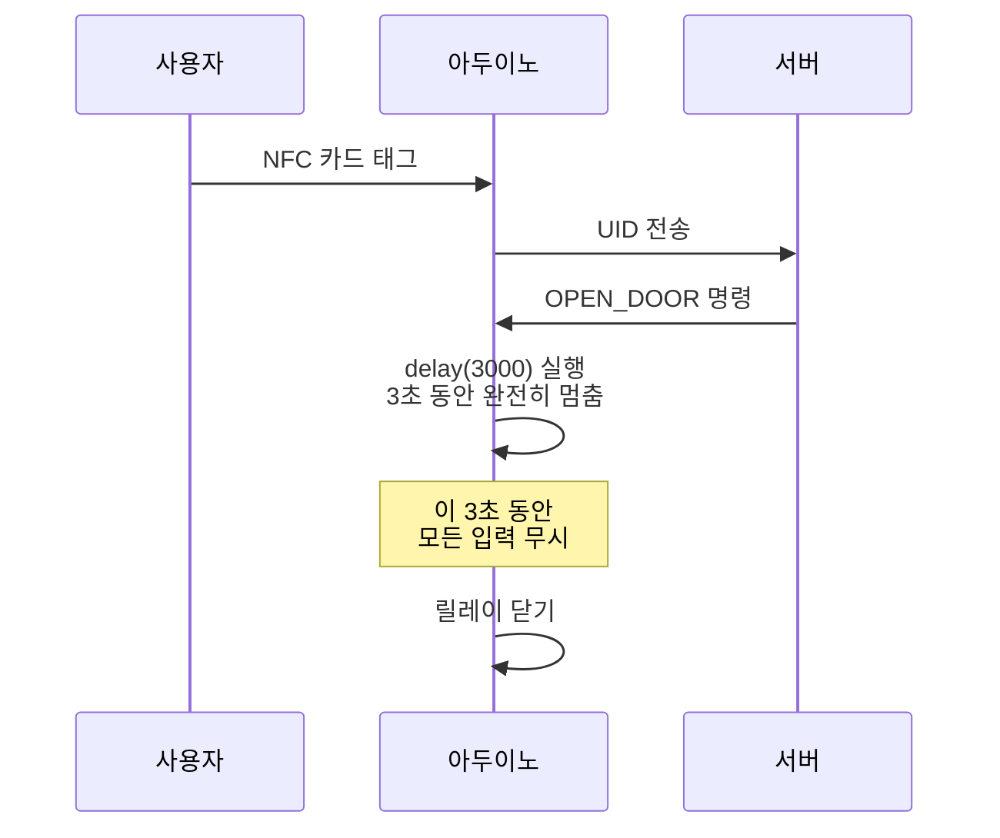
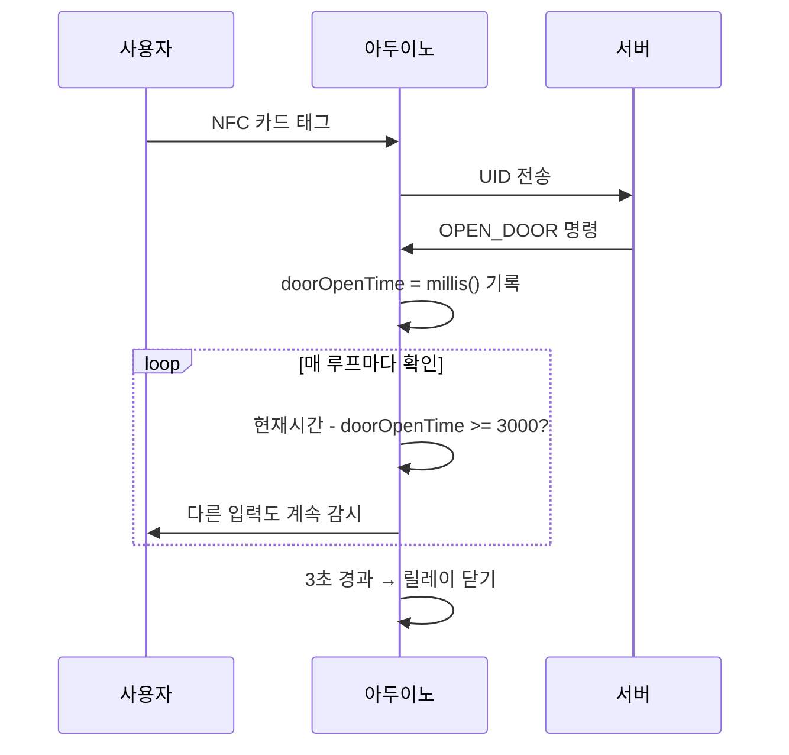

# 하드웨어 통합 도전기

## 문제: 문이 열리면 시스템이 멈춘다

아두이노에서 `delay(3000)` 함수를 써서 문이 3초 동안 열리도록 했더니, 그 3초 동안 아두이노 전체가 아무 신호도 받지 못하는 상태가 되었습니다. 누군가 카드를 대거나 비밀번호를 눌러도 반응이 없었습니다. 실제로 사용할 수 없는 수준의 결함이었습니다.

비유하자면, 문을 열어주는 동안 귀와 눈을 막고 있는 것과 같았습니다.

## 기존 방식: delay() 사용 (블로킹 방식)

블로킹(Blocking)이란 한 작업이 끝날 때까지 다른 일을 전혀 하지 못하는 방식입니다.

## 개선 방식: millis() 사용 (논블로킹 방식)

논블로킹(Non-blocking)이란 다른 작업을 기다리면서도 계속해서 입력을 확인하는 방식입니다.

## 조희은이 적용한 세 가지 해결책

**millis() 기반 타이머:** `delay()`를 모두 제거하고, 현재 시각을 밀리초(1/1000초) 단위로 확인하는 `millis()` 방식으로 바꿨습니다. 이제 문이 열려 있는 동안에도 아두이노는 계속 다른 입력을 받을 수 있습니다.

**시리얼 프로토콜(통신 규격) 통일:** 서버와 주고받는 메시지를 `WAKEUP:NFC:UID` 형태처럼 명확한 규격으로 맞춰 통신 오류를 최소화했습니다.

**디바운싱(Debouncing) 처리:** 키패드의 기계적 떨림으로 숫자가 여러 번 입력되는 현상을 소프트웨어적으로 제거했습니다. 디바운싱이란 버튼을 한 번 눌러도 여러 번 눌린 것처럼 신호가 튀는 문제를 거르는 기술입니다.

## 완성: 끊김 없는 경험

이제 문이 열리는 중에도 다음 사용자의 입력을 바로 받을 수 있습니다. 하드웨어의 물리적 한계를 소프트웨어적 사고로 극복한 값진 경험이었습니다.
