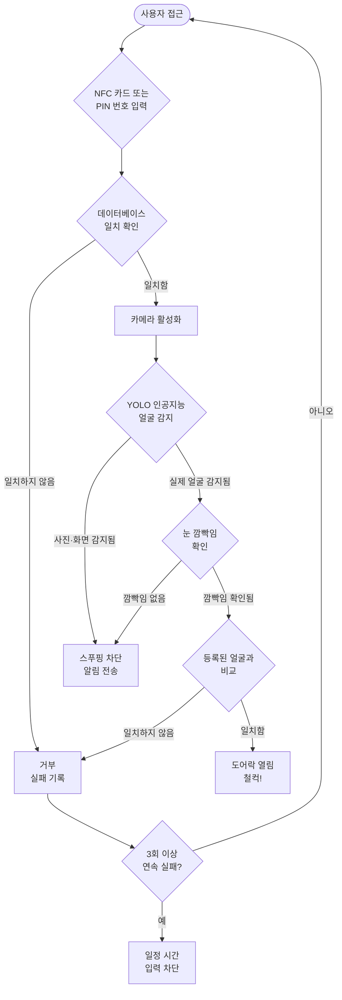
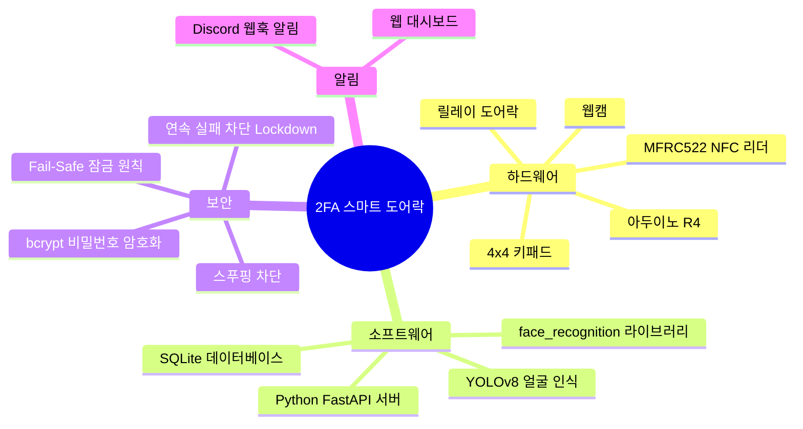

현관문 열쇠 하나면 안전할까요? 열쇠를 잃어버리거나 복사당하면 집 안이 그대로 열립니다. 이 프로젝트는 그 문제를 해결합니다. NFC 카드와 PIN 번호로 1차 확인을 하고, 인공지능 얼굴 인식으로 2차 확인을 거쳐야만 문이 열리는 **이중 인증(2FA) 스마트 도어락**입니다.

## 전체 동작 흐름

## 이 프로젝트는 뭔가요?

삼육대학교 디지털 논리 회로 실습 캡스톤 과제로 제작한 스마트 도어락 시스템입니다. 아두이노로 NFC 카드와 키패드를 제어하고, 파이썬 서버에서 YOLOv8 인공지능이 얼굴을 인식합니다. 두 가지 인증을 모두 통과해야 문이 열리며, 어느 한 단계가 고장나면 잠금 상태를 유지하는 Fail-Safe 원칙을 따릅니다.

## 어떤 기술을 사용하나요?

## 문서 읽는 순서

처음 접하는 분은 아래 순서로 읽으면 이해하기 쉽습니다.

1. **[2FA 쉽게 이해하기](system_docs/EASY_GUIDE.md)** — 2FA, YOLO, bcrypt 같은 핵심 용어를 비유와 그림으로 설명합니다. 여기부터 시작하세요.
2. **[시스템 구조 한눈에 보기](system_docs/architecture_mindmap.md)** — 하드웨어와 소프트웨어가 어떻게 연결되는지 전체 구조를 파악합니다.
3. **[시스템 설계 상세](system_docs/system_design.md)** — 각 구성 요소의 동작 방식을 더 깊이 이해합니다.
4. **[하드웨어 배선 및 사양](system_docs/hardware_spec.md)** — 실제 배선 방법과 핀 연결 정보를 확인합니다.
