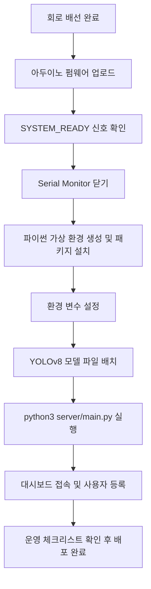

# 배포 가이드

## 배포 전체 흐름



## 1단계: 하드웨어 준비

- [ ] 하드웨어 사양 문서에 맞춰 회로를 배선합니다.
- [ ] `arduino/doorlock.ino`를 아두이노에 업로드합니다.
- [ ] Arduino IDE의 Serial Monitor를 `9600` baud로 열고 `SYSTEM_READY` 메시지가 출력되는지 확인합니다.
- [ ] 확인 후 Serial Monitor를 반드시 닫습니다. 시리얼 포트(Serial Port, 아두이노와 컴퓨터의 통신 통로)는 한 번에 한 프로그램만 사용할 수 있습니다.

## 2단계: 파이썬 서버 환경 설정

가상 환경(venv)을 만들고 필요한 패키지를 설치합니다.

```bash
python3 -m venv .venv
source .venv/bin/activate   # Windows: .venv\Scripts\activate
pip install -r requirements.txt
```

## 3단계: 환경 변수 설정

소스 파일을 직접 수정하지 않고, 환경 변수로 실행 값을 지정합니다.

```bash
export DOORLOCK_SERIAL_PORT=/dev/ttyACM0
export DOORLOCK_BAUD_RATE=9600
export DOORLOCK_DB_PATH=server/doorlock.db
export DOORLOCK_WEB_HOST=127.0.0.1
export DOORLOCK_WEB_PORT=8000
```

Windows에서는 `export` 대신 `$env:변수명="값"` 형식을 사용합니다. (예: `$env:DOORLOCK_SERIAL_PORT="COM3"`)

## 4단계: YOLOv8 모델 설정

```bash
export DOORLOCK_YOLO_MODEL_PATH=models/doorlock_yolov8n.pt
```

- [ ] 모델 파일(`doorlock_yolov8n.pt`)이 지정된 경로에 있는지 확인합니다.
- [ ] 모델은 얼굴, 휴대폰 화면, 열린 눈, 감긴 눈을 감지할 수 있어야 합니다.

하드웨어 없이 서버 흐름만 확인할 때는 `DOORLOCK_VISION_MOCK=1`로 데모 모드를 사용합니다. 실제 설치 환경에서는 사용하지 않습니다.

## 5단계: 서버 실행 및 사용자 등록

```bash
python3 server/main.py
```

`server/cert.pem`과 `server/key.pem`이 있으면 `https://localhost:8000`, 없으면 `http://localhost:8000`으로 접속합니다. 외부 장치에서 접속하려면 `DOORLOCK_WEB_HOST=0.0.0.0`으로 바인딩하고 방화벽을 별도로 설정합니다.

사용자 등록 순서:
- [ ] 대시보드 접속 → 사용자 추가 화면으로 이동합니다.
- [ ] 얼굴 정보를 캡처합니다.
- [ ] 이름, NFC UID(카드 고유 번호), PIN(비밀번호)을 입력하고 등록합니다.
- PIN은 bcrypt(복원 불가능한 암호화 방식)로 안전하게 저장됩니다.

## 운영 체크리스트

- [ ] `DOORLOCK_VISION_MOCK`은 설정하지 않거나 `0`으로 유지합니다.
- [ ] `DOORLOCK_ALLOW_UNENROLLED_FACE`는 설정하지 않거나 `0`으로 유지합니다.
- [ ] `DOORLOCK_YOLO_MODEL_PATH`가 실제 학습된 모델 파일을 가리키는지 확인합니다.
- [ ] 데이터베이스 파일은 공개 웹 경로 밖에 두고 소유자만 접근할 수 있도록 권한을 설정합니다.
- [ ] 아두이노, 릴레이, USB 케이블, 잠금장치 배선은 외부에서 접근하기 어려운 하우징(케이스) 안에 배치합니다.
- [ ] Arduino IDE Serial Monitor가 시리얼 포트를 점유하고 있지 않은지 확인합니다.
- [ ] 최소 한 명 이상의 사용자가 얼굴 정보까지 등록되어 있어야 합니다.
