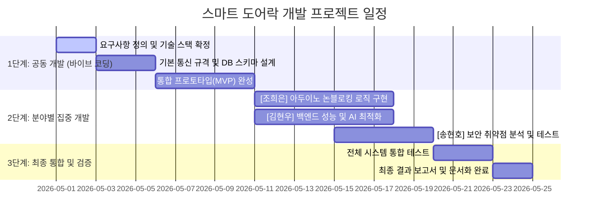

# 개발 계획

## 팀 구성 및 역할 분담

본 프로젝트는 1단계 공동 개발 이후, 각 분야를 한 명씩 깊이 파고드는 방식으로 진행합니다.

| 이름 | 역할 | 핵심 책임 |
|------|------|-----------|
| 공동 (전원) | 바이브 코딩 통합 개발 | 시스템 기본 설계, 아키텍처(구조) 확립, 통합 테스트 |
| 조희은 | 하드웨어 / 아두이노 담당 | 펌웨어 최적화, 논블로킹 제어 로직, 센서 정확도 개선 |
| 김현우 | 백엔드 / 비전 AI 담당 | 파이썬 서버 성능 최적화, 데이터베이스 구조 개선, AI 인식 속도 향상 |
| 송현호 | 테스터 / QA 및 보안 담당 | 취약점 분석, 사용자 경험(UX) 피드백, 예외 상황 발굴 |

## 세부 개발 일정

## 역할별 세부 업무 목록

### 공동: 1단계 바이브 코딩

- 시리얼 통신 규격(JSON 또는 문자열 형식) 확정
- SQLite 기본 테이블(사용자, 접근 기록) 생성
- YOLOv8과 얼굴 인식 연동 기초 코드 작성
- FastAPI 기반 실시간 모니터링 대시보드 초안 완성

### 조희은: 아두이노 개발

- `delay()`를 제거한 `millis()` 기반 논블로킹 루프 구현
- 키패드 입력 버퍼 관리 및 예외 처리 강화
- 릴레이 작동 상태(OPEN/CLOSED) 실시간 피드백 로직 추가
- 하드웨어 핀 배치 최적화 및 전기 간섭 제거

### 김현우: 파이썬 및 AI 성능 최적화

- SQLite WAL(쓰기 선행 로그) 모드 적용 및 데이터베이스 연결 최적화
- 비전 AI 처리 속도 분석 및 FPS(초당 프레임 수) 개선
- 얼굴 인코딩(인식 데이터) 보안 저장 및 로드 속도 향상
- 비동기(Asyncio) 처리를 통한 웹 서버 응답성 강화

### 송현호: 베타 테스트 및 보안 강화

- 사진·영상을 이용한 얼굴 인식 우회 시나리오 테스트
- 키패드 무차별 대입 공격(브루트포스)에 대한 잠금 로직 검증
- 시스템 부하 테스트 및 비정상 종료 시 복구 과정 점검
- 비전문가 관점의 설치·설정 가이드 가독성 피드백

## 주간 진행 관리

- **월요일:** 주간 목표 설정 및 역할별 이슈 공유
- **수요일:** 기술적 막힌 지점 해결을 위한 공동 코딩
- **금요일:** 주간 결과물 통합 및 상호 코드 리뷰
