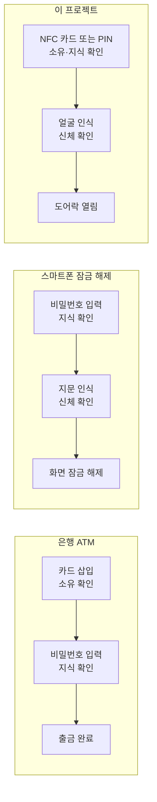
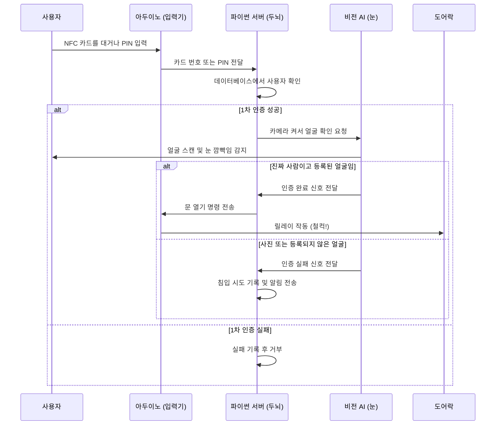
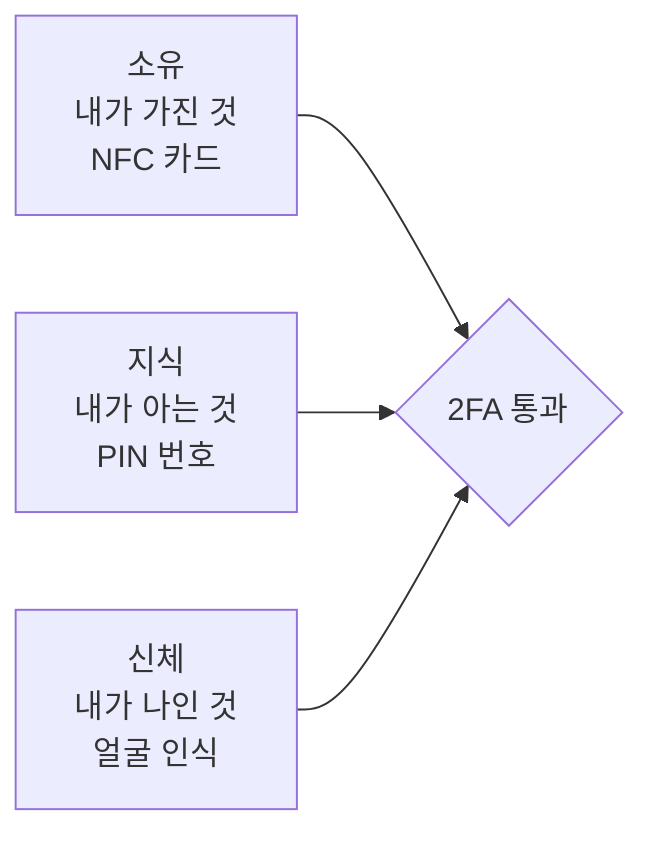
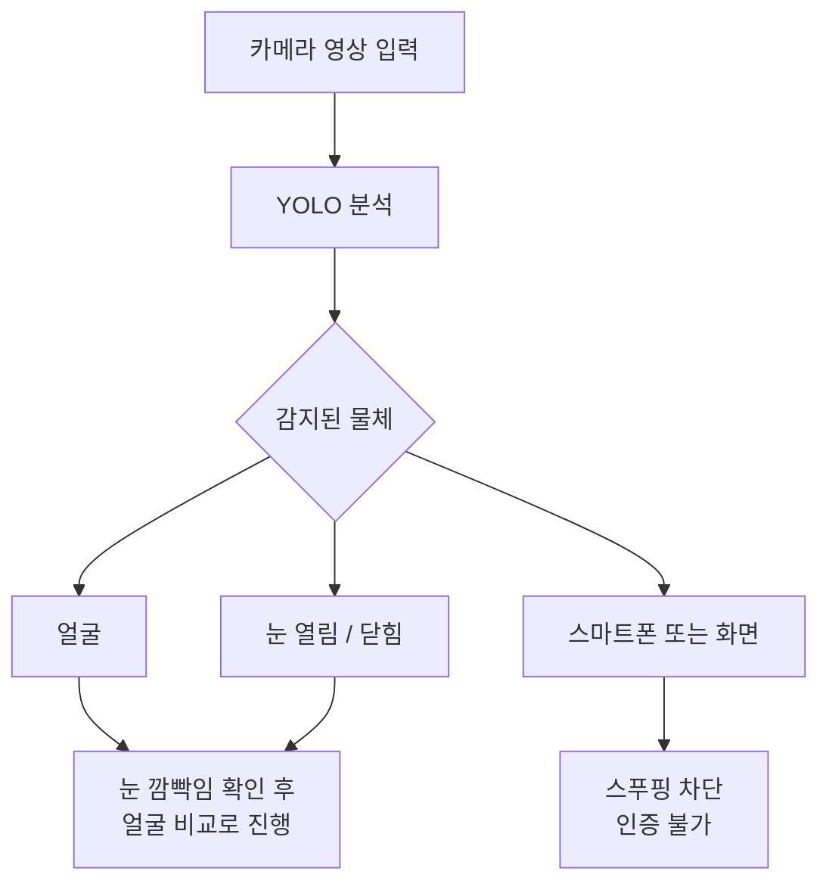
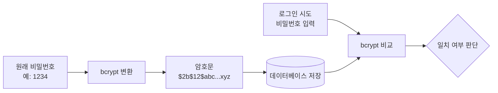
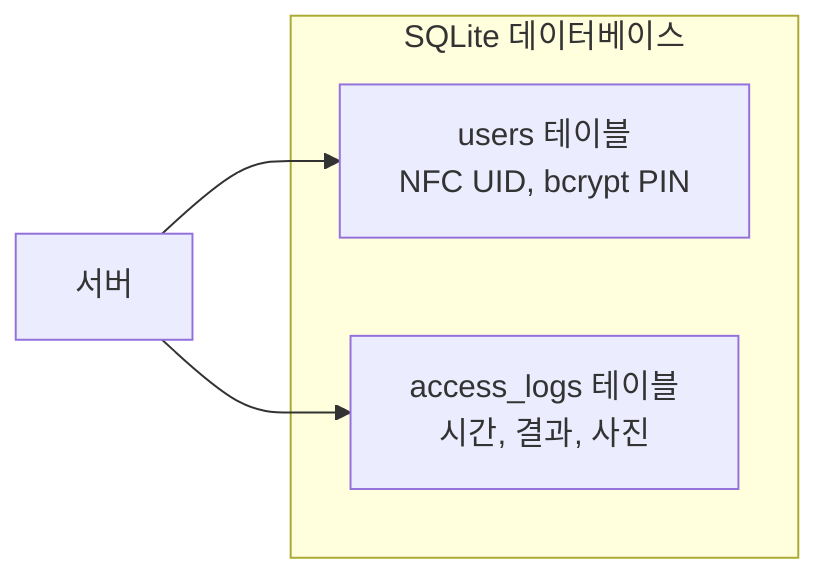
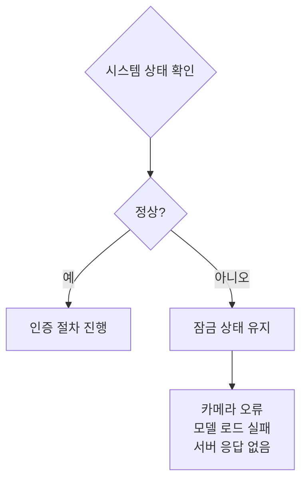

이 문서는 프로그래밍을 처음 접하는 분도 2FA 스마트 도어락의 작동 원리를 이해할 수 있도록 비유와 그림으로 설명합니다.

## 2FA란 무엇인가요?

2FA(Two-Factor Authentication, 이중 인증)란 신원을 확인할 때 두 가지 서로 다른 방법을 함께 사용하는 것입니다. 하나가 뚫려도 나머지 하나가 막아주기 때문에 훨씬 안전합니다.

### 실생활 속 2FA 비유

은행 ATM도, 스마트폰도 두 단계를 거치는 것처럼, 이 도어락도 두 단계를 거칩니다.

## 2FA 인증 전체 흐름

## 핵심 기술 용어 설명

### 2FA (이중 인증)

두 가지 방법으로 확인하는 것입니다. 열쇠와 지문, 카드와 비밀번호처럼 서로 다른 종류를 조합합니다.

### YOLO (욜로, You Only Look Once)

카메라 영상에서 사물을 실시간으로 찾아내는 인공지능입니다. 이름처럼 화면을 딱 한 번만 훑어봐도 얼굴, 스마트폰, 눈의 상태를 동시에 찾아냅니다.

### bcrypt (비크립트)

비밀번호를 알아볼 수 없는 암호문으로 변환하는 방식입니다. 데이터베이스가 유출되더라도 원래 비밀번호는 알 수 없습니다.

### SQLite (에스큐엘라이트)

시스템의 기록장 역할을 하는 데이터베이스입니다. 등록된 사용자 정보, 출입 기록, 실패 기록을 표 형태로 저장합니다.

## Fail-Safe 원칙이란?

Fail-Safe(페일 세이프)는 무언가 고장났을 때 가장 안전한 상태로 유지되는 원칙입니다. 이 시스템에서는 카메라가 연결되지 않거나 인공지능 모델을 불러오지 못하면 문을 열지 않고 잠금 상태를 유지합니다.

## 정리

이 시스템은 세 가지 원칙으로 작동합니다.

1. **두 번 확인합니다.** NFC 또는 PIN → 얼굴 인식, 두 단계를 모두 통과해야 문이 열립니다.
2. **속임수를 차단합니다.** 사진이나 화면을 카메라에 들이대면 YOLO가 즉시 감지하고 차단합니다.
3. **고장 시 잠급니다.** 시스템의 일부가 작동하지 않으면 문을 열지 않고 잠금 상태를 유지합니다.

다음 단계로 [시스템 구조 한눈에 보기](architecture_mindmap.md)를 읽으면 하드웨어와 소프트웨어가 어떻게 연결되는지 전체 그림을 파악할 수 있습니다.
