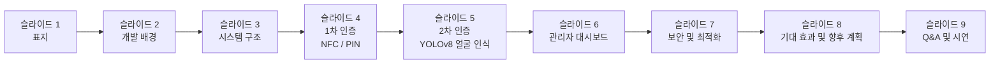

# 발표 가이드

## 슬라이드 구성 흐름

## 슬라이드별 내용 가이드

### 슬라이드 1: 표지

- **제목:** 안전에 지능을 더하다: 2FA 스마트 도어락 시스템
- **부제:** NFC/PIN 1차 인증과 비전 AI 기반 2차 인증의 통합 솔루션
- **발표자:** 팀명과 팀원 이름을 기재합니다.

### 슬라이드 2: 개발 배경 및 목적

- 기존 도어락의 보안 취약점을 제시합니다. (비밀번호 노출, 카드 복제 위험)
- 해결 방법을 세 가지 인증 요소로 설명합니다. "알고 있는 것(PIN)" + "가진 것(NFC 카드)" + "나 자신(얼굴)"
- 프로젝트 목표를 한 문장으로 요약합니다.

### 슬라이드 3: 시스템 구조 (시각화 필수)

- `README.md`의 Mermaid 다이어그램을 슬라이드에 삽입합니다.
- 핵심 요소를 세 줄로 정리합니다.
  - 하드웨어: 아두이노, NFC 리더(MFRC522), 키패드, 릴레이
  - 소프트웨어: 파이썬(FastAPI), YOLOv8, SQLite
  - 통신: 시리얼 프로토콜

### 슬라이드 4: 1차 인증 - NFC 및 PIN

- MFRC522 라이브러리로 NFC 카드 UID를 읽는 과정을 설명합니다.
- bcrypt(비밀번호를 복원할 수 없는 형태로 저장하는 암호화 방식) 적용으로 데이터베이스가 유출되어도 안전함을 강조합니다.
- 아두이노와 NFC 키패드 연결 사진 또는 배선도를 첨부합니다.

### 슬라이드 5: 2차 인증 - 비전 AI (YOLOv8)

- YOLOv8 기반 객체 탐지(사진 속 물체 위치와 종류를 실시간으로 찾아내는 기술)와 얼굴 대조 과정을 설명합니다.
- 두 가지 보안 포인트를 강조합니다.
  - 스마트폰 화면에 띄운 사진으로 속이는 스푸핑 공격 차단
  - 눈 깜빡임 감지로 살아 있는 사람(Liveness) 여부 판별
- YOLO가 얼굴과 스마트폰을 동시에 감지하는 캡처 화면을 삽입합니다.

### 슬라이드 6: 관리자 대시보드

- 실시간 접근 기록, 사용자 등록, 침입 시도 사진 확인 기능을 소개합니다.
- FastAPI와 Starlette 템플릿 엔진으로 만든 웹 화면임을 간략히 언급합니다.
- 실제 실행 중인 대시보드 스크린샷을 삽입합니다.

### 슬라이드 7: 보안 및 최적화 전략

- 락다운(Lockdown) 모드: 연속 인증 실패 시 시스템을 일시 차단하는 기능을 설명합니다.
- 논블로킹(Non-blocking) 펌웨어와 SQLite WAL 모드 적용 효과를 설명합니다.
- 인증 성공 시에만 릴레이(Relay, 전기 신호로 문 잠금을 제어하는 부품) 명령이 전달되는 Fail-Safe 구조를 강조합니다.

### 슬라이드 8: 기대 효과 및 향후 계획

- 저비용으로 기업 수준의 출입 통제 시스템을 구현할 수 있음을 정리합니다.
- 향후 계획 세 가지를 제시합니다.
  - 시리얼 통신 암호화 적용
  - 모바일 앱 연동 및 푸시 알림 강화
  - 얼굴 인식 모델 경량화 및 속도 개선

### 슬라이드 9: Q&A 및 시연

- 예상 질문과 답변을 미리 준비합니다.
- 실제 작동 영상 또는 라이브 시연으로 마무리합니다.

## 디자인 권장 사항

- **폰트:** 가독성이 좋은 산세리프 계열 (프리텐다드, 나눔스퀘어 등)
- **색상 테마:** 메인 딥 블루(신뢰·보안) + 강조 민트 또는 오렌지(인증 성공·경고)
- **이미지 배치:** 텍스트보다 다이어그램과 실제 구동 화면 스크린샷 위주로 구성합니다.
