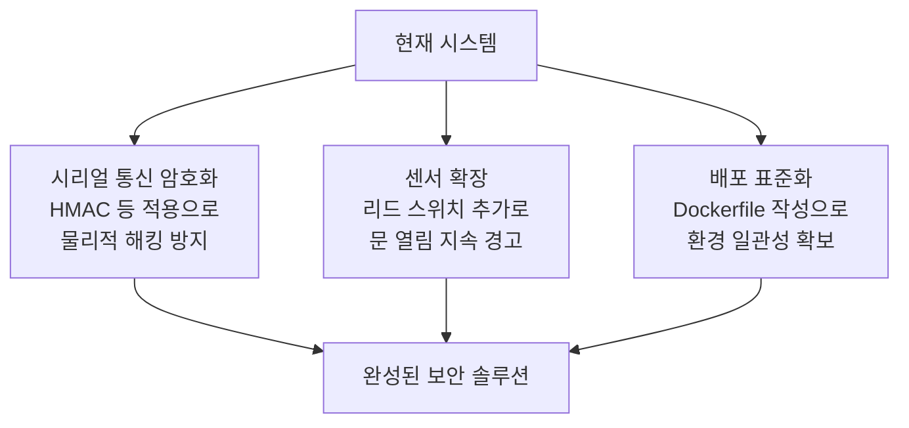

# 프로젝트 평가

## 평가 항목별 결과

| 평가 항목 | 등급 | 요약 |
|-----------|------|------|
| 아키텍처 및 시스템 설계 | 우수 | 모듈별 역할 분리 명확, 2단계 인증 흐름 견고 |
| 보안 분석 | 양호 (일부 개선 필요) | bcrypt 해싱·스푸핑 방지 훌륭, 시리얼 통신 평문 전송 한계 |
| 코드 품질 | 우수 | 변수명 직관적, 예외 처리 꼼꼼, DB 동시성 제어 양호 |
| 테스트 및 품질 보증 | 우수 | 단위 테스트 50개, 의존성 없는 환경에서도 실행 가능 |

### 세부 내용

**아키텍처 및 시스템 설계:** 하드웨어 제어, 데이터베이스 관리, 비전 AI, 웹 서버로 역할이 명확하게 나뉘어 있습니다. 스푸핑(spoofing, 사진이나 영상으로 얼굴 인식을 속이는 공격)을 막기 위해 눈 깜빡임 감지 로직을 포함한 점이 특히 높은 평가를 받았습니다.

**보안 분석:** 비밀번호를 bcrypt(단방향 해시 함수, 원래 값을 복원할 수 없는 암호화 방식)로 저장하고, 타이밍 공격(Timing Attack, 처리 시간을 측정해 비밀번호를 추측하는 기법)을 방어하는 구조를 갖췄습니다. 다만 아두이노와 파이썬 서버 사이의 시리얼 통신 명령이 평문(암호화되지 않은 상태)으로 전송되는 점은 개선이 필요합니다.

**코드 품질:** 변수명과 메서드명이 직관적이며, 데이터베이스 연결 오류·파일 오류·라이브러리 누락 등 다양한 예외 상황에 대비한 방어적 코딩이 잘 갖춰져 있습니다.

**테스트 및 품질 보증:** 50개의 단위 테스트가 데이터베이스 로직, 비전 모델, 보안 필터링 등 시스템 전반을 커버합니다. 외부 라이브러리가 없는 환경에서도 목(Mock, 가짜 모듈)을 활용해 테스트가 실행되는 구조도 인상적입니다.

## 개선 방향

### 권장 개선 사항

1. **시리얼 통신 암호화:** `WAKEUP`, `OPEN_DOOR` 같은 명령을 HMAC(해시 기반 메시지 인증 코드)으로 보호하여 물리적 릴레이 해킹을 방지합니다.
2. **센서 확장:** 리드 스위치(Reed Switch, 자석의 힘으로 열고 닫히는 센서)를 추가하면 "문 열림 유지 경고" 기능을 구현할 수 있습니다.
3. **배포 표준화:** Dockerfile을 추가하여 어떤 컴퓨터에서도 같은 환경으로 실행할 수 있게 만들면 설치 과정이 훨씬 간편해집니다.
