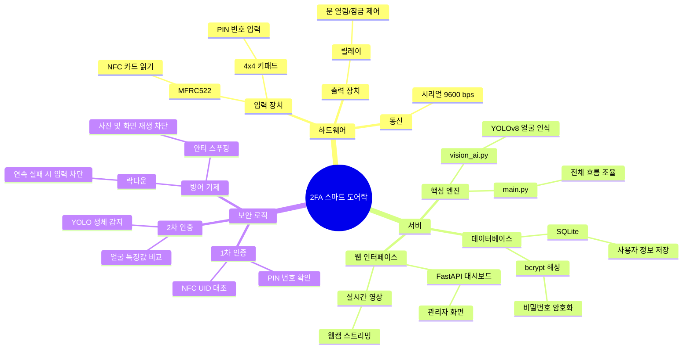
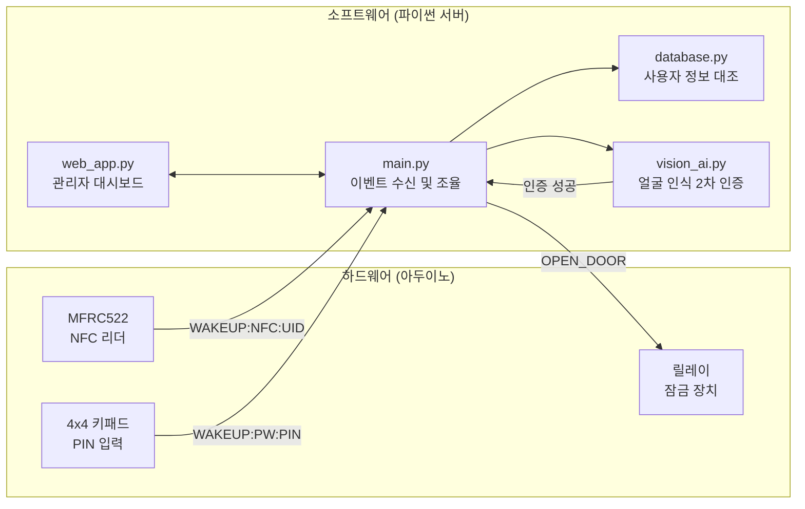

## 전체 구조 마인드맵

2FA 스마트 도어락은 **하드웨어(아두이노)**와 **소프트웨어(파이썬 서버)** 두 부분으로 이루어져 있습니다. 아래 마인드맵으로 전체 구성을 한눈에 확인합니다.

---

## 하드웨어-소프트웨어 연결 흐름도

아두이노와 파이썬 서버가 **시리얼 통신**으로 연결되어 함께 동작하는 방식을 나타냅니다.

---

## 구성요소 한 줄 설명

| 구성요소 | 역할 |
|---|---|
| MFRC522 | NFC 카드의 고유 번호(UID)를 읽어 서버로 전달합니다. |
| 4x4 키패드 | 사용자가 PIN 번호를 누르면 서버로 전달합니다. |
| 릴레이 | 서버로부터 허가 신호를 받으면 잠금 장치 전원을 제어합니다. |
| main.py | 시리얼 통신을 감시하며 인증 흐름 전체를 조율합니다. |
| database.py | 사용자 정보와 출입 기록을 SQLite 데이터베이스로 관리합니다. |
| vision_ai.py | YOLOv8 모델로 화면 재생을 차단하고 등록된 얼굴을 확인합니다. |
| web_app.py | FastAPI 기반 관리자 웹 화면과 API 경로를 제공합니다. |
| notifier.py | 보안 이벤트 발생 시 관리자에게 실시간으로 알림을 보냅니다. |
