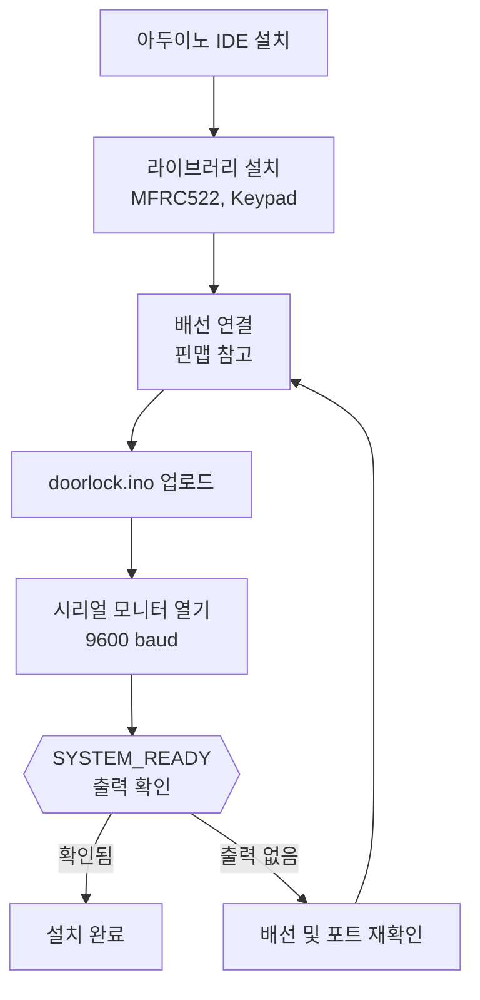

## 설치 순서 한눈에 보기

---

## 1단계: 라이브러리 설치

Arduino IDE의 **라이브러리 관리자(Library Manager)**에서 다음 두 가지를 검색하여 설치합니다.

| 라이브러리 | 설명 |
|---|---|
| `MFRC522` | NFC 카드 리더기(MFRC522 모듈) 제어 라이브러리 |
| `Keypad` by Mark Stanley and Alexander Brevig | 4x4 매트릭스 키패드 입력 처리 라이브러리 |

---

## 2단계: 배선 연결

핀 연결은 [하드웨어 사양](hardware_spec.md) 문서의 핀맵을 기준으로 합니다. 핵심 핀 배치는 아래와 같습니다.

| 모듈 | 아두이노 핀 |
|---|---|
| MFRC522 (SPI) | D10, D11, D12, D13 |
| MFRC522 Reset | A2 |
| 4x4 키패드 | D2 ~ D8, A0 |
| 릴레이 신호선 | A1 |

> **주의:** 릴레이 신호선은 SPI 핀 및 키패드 핀과 겹치지 않도록 A1 핀을 사용합니다. 배선 전에 핀맵을 꼭 확인합니다.

---

## 3단계: 펌웨어 업로드

1. Arduino IDE에서 `arduino/doorlock.ino`를 엽니다.
2. **보드** 메뉴에서 사용하는 보드를 선택합니다. Arduino UNO R4 Minima를 사용하는 경우 해당 항목을 선택합니다.
3. **포트** 메뉴에서 아두이노가 연결된 포트를 선택합니다.
4. 업로드 버튼을 눌러 스케치를 업로드합니다.

> **참고:** `arduino/doorlock_firmware.ino`는 호환용 사본입니다. 기준 파일은 `doorlock.ino`입니다.

---

## 4단계: 시리얼 통신 테스트

업로드 완료 후 Serial Monitor를 **9600 baud**로 열어 다음 메시지를 확인합니다.

| 동작 | 예상 시리얼 출력 |
|---|---|
| 리셋 직후 | `SYSTEM_READY` |
| 등록된 NFC 카드 태그 | `WAKEUP:NFC:<UID>` |
| 4자리 PIN 입력 완료 | `WAKEUP:PW:<PIN>` |
| 서버가 `OPEN_DOOR` 전송 | `DOOR_OPENED` → 3초 후 `DOOR_CLOSED` |

문이 열린 상태에서도 NFC와 키패드 입력은 계속 응답합니다. 릴레이 타이머가 동작하는 동안 입력 처리가 멈추지 않습니다.
