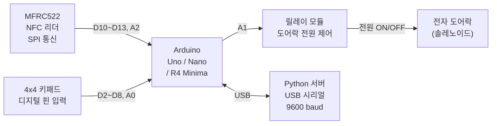
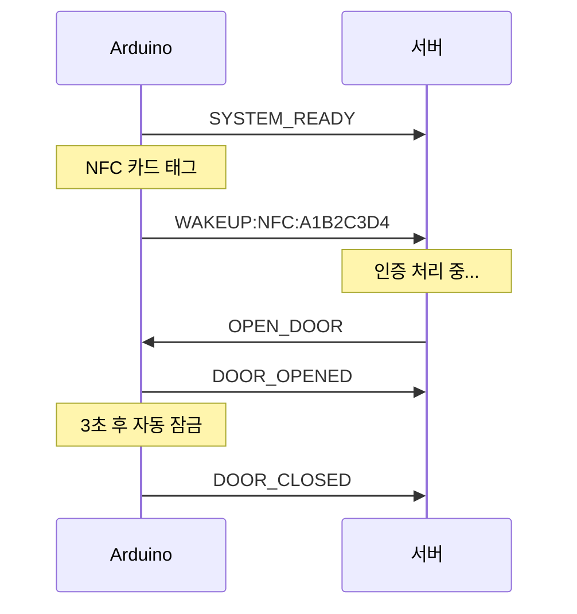

# 하드웨어 사양

Arduino(아두이노)를 중심으로 NFC 리더, 키패드, 릴레이가 연결됩니다. 아두이노는 직접 문을 열지 않고, 서버의 명령을 받은 뒤에만 릴레이를 동작시킵니다.

## 하드웨어 연결 구성도

## 핀 연결표

| 부품 | 신호 | Arduino 핀 | 비고 |
|------|------|------------|------|
| MFRC522 | SDA/SS | D10 | SPI 슬레이브 선택 |
| MFRC522 | SCK | D13 | 하드웨어 SPI |
| MFRC522 | MOSI | D11 | 하드웨어 SPI |
| MFRC522 | MISO | D12 | 하드웨어 SPI |
| MFRC522 | RST | A2 | 키패드 핀과 겹치지 않도록 A2 사용 |
| 키패드 | 행(Row) 1~4 | D2, D3, D4, D5 | 행 스캔 |
| 키패드 | 열(Col) 1~4 | D6, D7, D8, A0 | 열 스캔 |
| 릴레이 | Signal | A1 | LOW=잠금, HIGH=열림 (active-high 기준) |

> 릴레이 모듈이 active-low 방식이면 코드에서 `RELAY_LOCKED`와 `RELAY_UNLOCKED` 값을 서로 바꿉니다.

## 각 부품이 하는 일

**MFRC522 NFC 리더 (NFC/RFID 카드 인식 모듈)**
- 사용자가 NFC 카드를 가져다 대면 카드 고유 번호(UID)를 읽습니다.
- SPI(직렬 주변기기 인터페이스) 방식으로 아두이노와 통신합니다.
- 읽은 UID를 `WAKEUP:NFC:<UID>` 형식으로 서버에 전달합니다.

**4x4 키패드**
- 사용자가 숫자 PIN을 직접 눌러 입력합니다.
- 행·열 스캔 방식으로 어느 키가 눌렸는지 감지합니다.
- 입력 완료 후 `WAKEUP:PW:<PIN>` 형식으로 서버에 전달합니다.

**릴레이 모듈 (Relay)**
- 서버에서 `OPEN_DOOR` 명령을 받으면 전자 도어락 전원을 잠깐 연결합니다.
- 타이머가 끝나면 자동으로 다시 잠금 상태로 돌아갑니다.
- 아두이노 자체 전원(5V)이 아닌 별도 전원으로 도어락을 구동합니다.

## 시리얼 통신 예시

## 시리얼 메시지 표

| 방향 | 메시지 예시 | 설명 |
|------|------------|------|
| Arduino → 서버 | `SYSTEM_READY` | 아두이노 부팅 완료 |
| Arduino → 서버 | `WAKEUP:NFC:A1B2C3D4` | NFC UID 전송 |
| Arduino → 서버 | `WAKEUP:PW:1234` | 키패드 PIN 전송 |
| 서버 → Arduino | `OPEN_DOOR` | 릴레이 열기 명령 |
| Arduino → 서버 | `DOOR_OPENED` | 릴레이 열림 확인 |
| Arduino → 서버 | `DOOR_CLOSED` | 릴레이 잠금 복귀 |

## 전기 안전 주의사항

- 아두이노와 릴레이 모듈의 GND(접지)를 반드시 공통으로 연결합니다.
- 전자 도어락(솔레노이드)은 아두이노 5V 핀으로 직접 구동하지 않습니다. 별도 전원 어댑터와 릴레이를 사용합니다.
- USB 시리얼 케이블과 내부 배선은 잠금형 하우징 안에 보관합니다. 현재 통신은 평문이므로 물리적 접근을 차단하는 것이 중요합니다.
