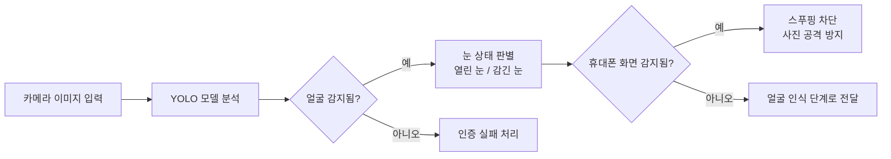

# AI 모델 설정

## YOLO란 무엇인가요?

YOLO(You Only Look Once, 한 번만 보면 된다)는 카메라 영상에서 사람, 얼굴, 사물 등을
실시간으로 찾아내는 인공지능(AI) 탐지 알고리즘입니다. 이 프로젝트에서는 YOLO nano(초경량 버전)를
사용하여 라즈베리파이(Raspberry Pi)처럼 성능이 낮은 기기에서도 빠르게 동작하도록 설계하였습니다.

## 모델 동작 과정



## 모델 파일 설치 방법

학습된 모델 파일은 용량이 크기 때문에 저장소(GitHub)에 포함되지 않습니다.
아래 경로에 직접 파일을 복사하여 배치합니다.

```text
models/doorlock_yolov8n.pt
```

## 환경 변수(Environment Variable) 설정

감지 대상 이름은 `.env` 파일이나 운영체제 환경 변수로 조정할 수 있습니다.

| 환경 변수 이름 | 설명 |
|---|---|
| `DOORLOCK_YOLO_FACE_CLASSES` | 얼굴로 인식할 클래스 이름 |
| `DOORLOCK_YOLO_PHONE_CLASSES` | 차단할 화면 장치 이름 (태블릿, 모니터 등) |
| `DOORLOCK_YOLO_OPEN_EYE_CLASSES` | 열린 눈으로 인식할 클래스 이름 |
| `DOORLOCK_YOLO_CLOSED_EYE_CLASSES` | 감긴 눈으로 인식할 클래스 이름 |

환경에 따라 모델 파일명이나 클래스 이름이 달라질 수 있으므로,
팀원 간에 동일한 설정값을 공유하여 사용합니다.
