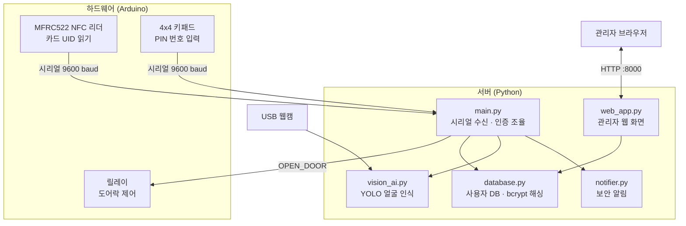
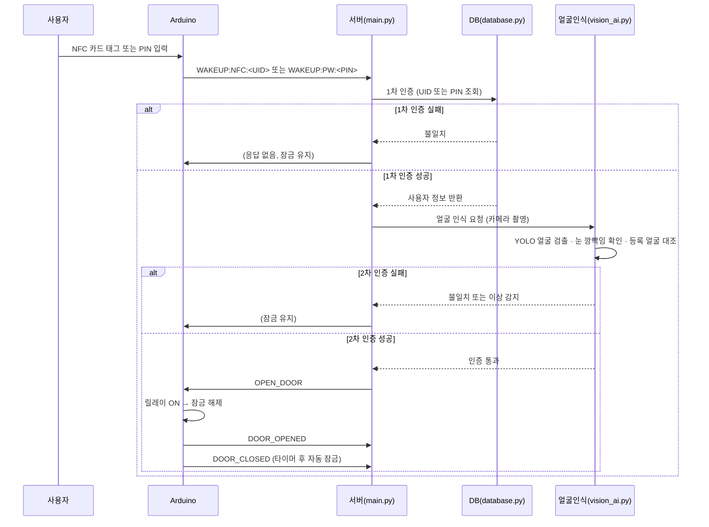
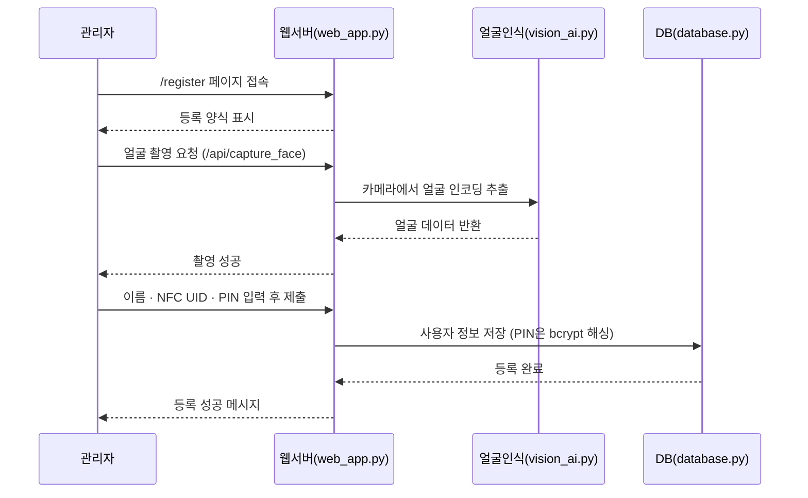

# 시스템 설계

이 시스템은 NFC 카드 또는 PIN 번호로 1차 인증을 하고, 웹캠과 YOLOv8 얼굴 인식으로 2차 인증을 합니다. 두 가지 인증을 모두 통과해야만 문이 열립니다.

## 시스템 블록 구성

## 인증 흐름

## 웹 등록 과정

관리자가 브라우저에서 신규 사용자를 등록하는 흐름입니다.

## 데이터베이스 구조

| 테이블 | 주요 필드 | 역할 |
|--------|-----------|------|
| `users` | `username`, `nfc_uid`, `password`, `face_encoding` | 사용자 식별 정보 및 얼굴 템플릿 저장 |
| `access_logs` | `timestamp`, `method`, `status`, `snapshot` | 출입 기록 및 침입 사진 저장 |

| 상태 값 | 의미 |
|---------|------|
| `1ST_AUTH_SUCCESS` | NFC 또는 PIN이 등록 사용자와 일치 |
| `FINAL_SUCCESS` | 얼굴 인식까지 통과, 문 열림 명령 전송 |
| `FINAL_FAIL` | 1차 인증은 통과했지만 얼굴 인식 실패 |
| `UNAUTHORIZED` | 1차 인증 단계에서 NFC 또는 PIN 불일치 |

## 시리얼 프로토콜

Arduino와 서버는 USB 시리얼(9600 baud)로 통신합니다.

| 방향 | 메시지 | 설명 |
|------|--------|------|
| Arduino → 서버 | `SYSTEM_READY` | 아두이노 부팅 완료 |
| Arduino → 서버 | `WAKEUP:NFC:<UID>` | NFC 카드 감지, UID 전달 |
| Arduino → 서버 | `WAKEUP:PW:<PIN>` | 키패드 PIN 전달 |
| 서버 → Arduino | `OPEN_DOOR` | 릴레이를 열도록 명령 |
| Arduino → 서버 | `DOOR_OPENED` | 릴레이가 열린 상태로 전환됨 |
| Arduino → 서버 | `DOOR_CLOSED` | 릴레이가 잠긴 상태로 복귀 |

## 보안 정책 요약

- **실패 시 거부**: 카메라, YOLO 모델, 얼굴 데이터 중 하나라도 없으면 문을 열지 않습니다.
- **요청 제한**: 인증 실패 후 3초간 추가 입력을 무시합니다.
- **잠금 모드**: 1시간 내 10회 이상 실패하면 입력을 5초씩 지연시킵니다.
- **눈 깜빡임 확인**: 사진 인쇄물이나 화면으로 속이는 것을 방지합니다.
- **PIN 해싱**: PIN은 bcrypt(단방향 암호화)로 변환하여 저장합니다.
