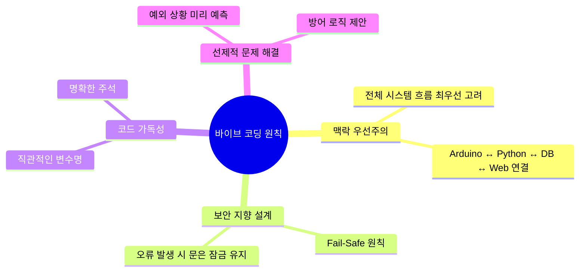

# 마스터 프롬프트

## 바이브 코딩이란?

바이브 코딩(Vibe Coding)은 AI에게 단순히 코드를 시키는 것이 아니라,
프로젝트의 목적과 전체 구조를 먼저 이해시킨 뒤 함께 설계하고 개선해 나가는 개발 방식입니다.
이 프로젝트에서는 AI를 단순 도우미가 아닌 팀의 파트너로 활용합니다.

## 바이브 코딩 4대 원칙

## 프로젝트 개요

본 프로젝트는 Arduino와 Python(FastAPI)을 결합하여 이중 인증(2FA, Two-Factor Authentication)
스마트 도어락 시스템을 구축합니다.

- **1차 인증:** NFC 카드 태그 또는 PIN 번호(비밀번호) 입력
- **2차 인증:** YOLOv8 기반 얼굴 인식 및 눈 깜빡임 감지(생체 인증)
- **관리 기능:** 이상 징후 발생 시 관리자에게 실시간 알림 전송

## 프롬프트 사용 순서

이 마스터 프롬프트를 AI에게 먼저 입력하여 전체 방향성을 학습시킵니다.
이후 `sub_prompts` 폴더의 세부 프롬프트를 단계별로 순서에 따라 입력하여 개발을 진행합니다.

> **주의:** 본 시스템은 실제 보안 환경에 적용될 수 있습니다. 라이브러리 업데이트나
> 로직 수정 시에는 반드시 하방 호환성(이전 버전과의 호환)과 보안 취약점을 점검합니다.
