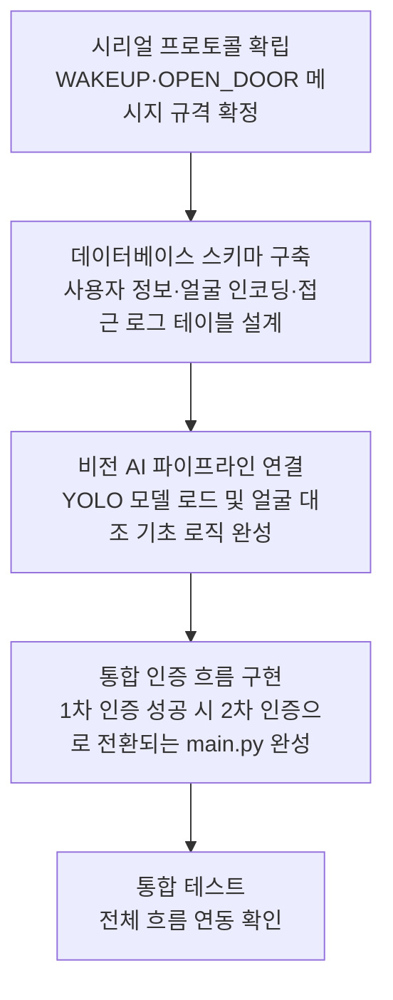

# 공동 개발 프롬프트

## 이 단계의 목적

모든 팀원이 협력하여 시스템의 뼈대를 함께 구축합니다.
하드웨어(Arduino)와 소프트웨어(Python)의 통신 규격을 확립하고,
기본 인증 흐름이 끊김 없이 연결되도록 통합하는 것이 핵심입니다.

## 팀 개발 단계 흐름



## 개발 가이드

- "일단 돌아가게(Make it work)" 만드는 것을 첫 번째 목표로 삼되, 코드 간 결합도(의존성)는 낮게 유지합니다.
- 모든 기능은 독립적으로 테스트할 수 있도록 함수와 모듈로 분리합니다.
- 하드웨어가 없는 팀원을 위해 `DOORLOCK_VISION_MOCK` 같은 모의(Mock) 실행 환경을 반드시 포함합니다.

## AI 명령 예시

```
현재 시스템의 아키텍처를 기반으로, main.py에서 시리얼 입력을 받아
database.py를 조회하고, 성공 시 vision_ai.py의 인증 함수를 호출하는
전체 제어 루프를 작성해줘. 예외 발생 시 로그를 남기는 것도 포함해줘.
```
