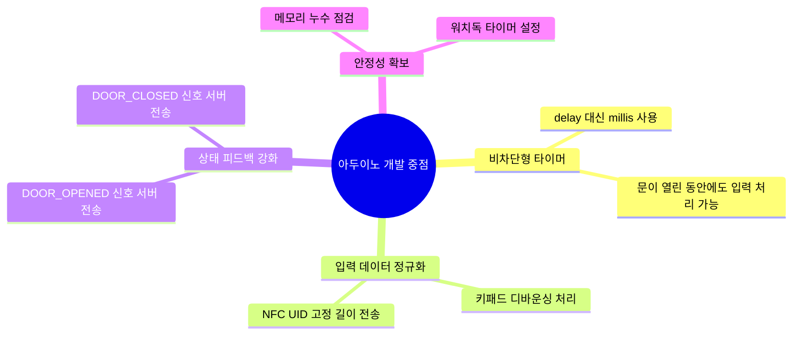

# 아두이노 개발 프롬프트

## 이 단계의 목적

하드웨어 계층의 안정성과 반응 속도를 극대화합니다.
NFC 리더와 키패드의 입력 간섭을 최소화하고, 서버 명령에 따라
릴레이(문 잠금 장치)를 정확하게 제어하는 펌웨어(하드웨어 제어 프로그램)를 완성합니다.

## 개발 중점 사항



## 개발 가이드

- 하드웨어 제어에서는 0.1초의 지연도 사용자 경험에 큰 영향을 줍니다. 반응 속도를 최우선으로 최적화합니다.
- 핀 맵(Pin Map) 충돌이 없도록 하드웨어 사양 문서를 엄격히 준수합니다.

## AI 명령 예시

```
arduino/doorlock.ino 파일의 릴레이 제어 부분을 millis() 기반으로 변경해줘.
문이 열려 있는 3초 동안에도 새로운 NFC 태그나 비밀번호 입력이 들어오면
이를 즉시 시리얼로 전송할 수 있는 구조가 필요해.
MFRC522와 Keypad 라이브러리의 핀 설정이 겹치지 않는지도 확인해줘.
```
