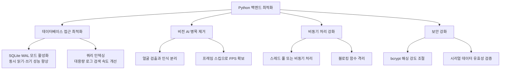

# 파이썬 최적화 프롬프트

## 이 단계의 목적

Python 서버의 처리 성능을 높이고, 비전 AI(영상 분석)의 정확도와
처리 속도를 최적화합니다. 대량의 로그(접근 기록)가 쌓여도 데이터베이스 성능이
저하되지 않도록 개선하며, 영상 분석 지연을 최소화합니다.

## 최적화 영역



## 개발 가이드

- 최적화 전후의 성능 수치를 측정할 수 있도록 프로파일링(성능 측정) 코드를 함께 작성합니다.
- `vision_ai.py`에서 불필요한 모델 로드 과정을 줄이고 캐싱(결과 저장 재사용)을 활용합니다.

## AI 명령 예시

```
server/vision_ai.py의 verify_face 함수 실행 중 웹 GUI 실시간 영상이
끊기는 현상이 있어. 영상 분석 로직을 별도 스레드에서 실행하거나
분석 주기를 최적화하는 코드를 작성해줘.
SQLite DB 연결 시 성능을 높일 수 있는 설정값들도 함께 제안해줘.
```
