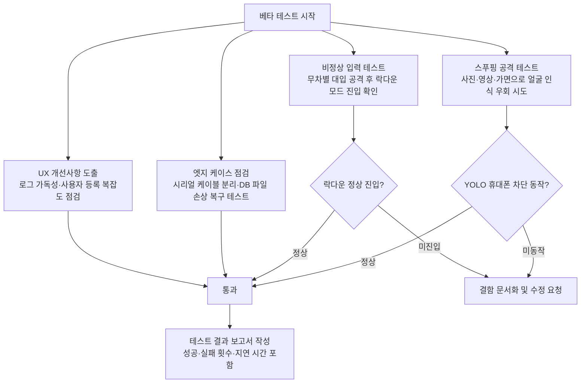

# 베타 테스트 프롬프트

## 이 단계의 목적

실제 사용자의 관점에서 시스템의 허점을 찾아내고, 보안 취약점을 분석합니다.
기술적 결함뿐만 아니라 사용 편의성(UX) 측면의 불편함도 함께 도출합니다.

## 테스트 시나리오 흐름



## 개발 가이드

- "안 되는 이유"를 찾는 데 집중합니다. 모든 예외 상황은 문서화하여 개발팀 전체와 공유합니다.
- 테스트 결과는 객관적인 지표(성공·실패 횟수, 지연 시간)와 함께 기록합니다.

## AI 명령 예시

```
현재 시스템의 보안 설정을 바탕으로 공격자가 수행할 수 있는 5가지
주요 시나리오와 각 시나리오별 방어 대책을 정리해줘.
특히 스마트폰 화면으로 사진을 보여줄 때 YOLO 로직이 이를
얼마나 정확하게 감지하는지 테스트하는 방법론도 제안해줘.
```
